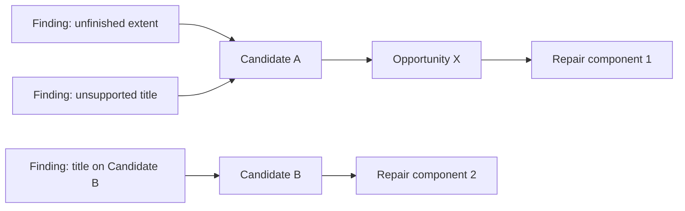
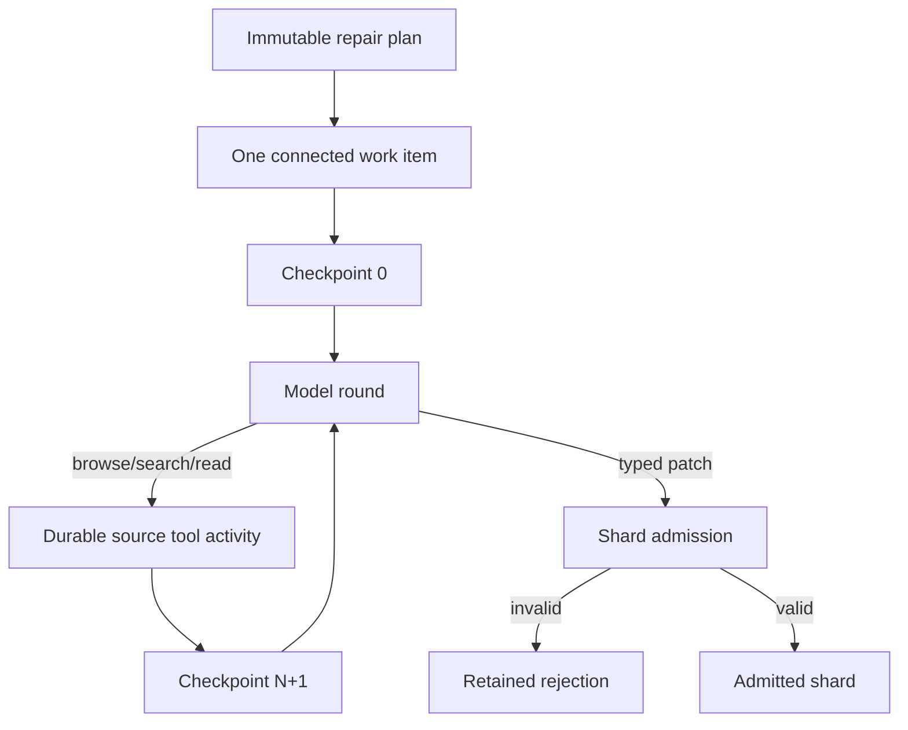
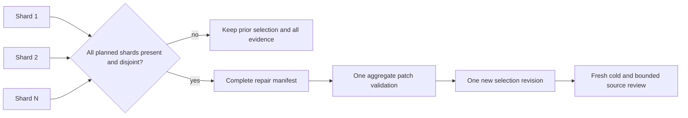

# Bounded atomic topic repair

Date: 2026-09-14  
Program: `standalone-topics/7`  
Status: implemented and locally validated; exact clean-commit gate passed; real-route qualification
and long-source editorial evaluation remain open

## Problem

`standalone-topics/6` bounds opportunity discovery, author packaging and independent source review,
but every required reviewer finding still entered one repair prompt and one patch answer. The answer
could grow with the accepted portfolio. Splitting findings independently would create a more subtle
failure: two patches could edit the same candidate or opportunity, and applying whichever finishes
last would make the result depend on scheduling rather than reviewed authority.

Repair therefore needs bounded work and one atomic selection change. The unit of work is a connected
component of the reviewer's required findings, linked through the candidates and opportunities those
findings are allowed to change. Findings in one component stay together. Components can run
independently only when code later proves their actual writes are disjoint.

## Program boundary

The new Temporal type is `TopicSelectionWorkflowV7`, with policy `standalone-topics/7` and a
disjoint five-agent PydanticAI set. V7 inherits V4 bounded inventory, V5 bounded author packaging and
V6 bounded source review. It replaces only the historical whole-assessment patch call with:

1. an immutable `topic-repair-plan/1`;
2. one indexed model call per connected component;
3. an admitted `topic-repair-shard/1` or retained `topic-repair-shard-rejection/1` for every settled
   response;
4. a complete `topic-repair-manifest/1`; and
5. one application of the aggregate `TopicSelectionPatchV3` to the prior selection.

The controlled experiment operator and optional pre-flight can select V7. The web continues to
start V3. V7 is not a default and no earlier programme history is reinterpreted.

## Connected-component plan

Code selects only `required` findings from the exact assessment. Each finding contributes resource
keys for:

- every `affectedCandidateId`;
- every named `opportunityId`; and
- every existing opportunity currently mapped to one of its affected candidates.

A deterministic union-find pass connects findings that share any resource. Component order follows
the first finding's assessment order; candidate and opportunity order follows the accepted
selection. Each work item receives a stable `repair-component-NNNN` identity and the exact source
sections intersecting its finding-authorized evidence.

The plan refuses a coupled component above any current safety envelope:

| Resource | Maximum per component |
| --- | ---: |
| Required findings | 12 |
| Existing candidates | 8 |
| Opportunities | 24 |
| Authorized source sections | 8 |
| Patch operations | 16 |
| Initial repair prompt | 256 KiB |

An oversized coupled component is not divided, because doing so would manufacture independence the
review did not establish. It ends with an explicit adjudication diagnostic. These are request and
authority limits, not video-count or duration targets.

## Indexed repair loop

Up to three components run concurrently. Each one receives only:

- source-index identity and counts;
- its work-item identity and resource lists;
- the immutable rubric and patch hashes;
- affected candidates without transcript text;
- immutable opportunity definitions plus the few editable mapping fields;
- its required findings; and
- reviewed handoffs wholly inside the component.

It receives exactly `browse_source`, `search_source` and `read_source`. Browse is limited to the
work item's authorized source sections. Search and exact reads may reach elsewhere in the same
source so a repair can recover setup, completion or a later qualification. The prompt requires a
complete paginated browse of every assigned section, hybrid search, and an exact reread of every
finding span and every sentence used by a replacement candidate.

Every continuation uses the established `topic-agent-checkpoint/1` reconstruction contract. The
wire request is rebuilt from the unchanged component prompt and its latest compact checkpoint;
earlier assistant and tool messages are absent. Each tool/final round keeps its own ledger identity.
A known provider failure reloads the latest checkpoint for the same run, stage, `repair` role and
index. An unknown outcome remains fenced.

## Shard admission

A component patch must retain the plan's selection, evidence and rubric hashes. Admission requires:

- one through sixteen operations;
- operation IDs under `<work-item-id>:operation:`;
- every assigned finding cited, with no finding from another component;
- existing candidate writes confined to `candidateIds`;
- new candidate IDs from `add_opportunity` under `<work-item-id>:candidate:`;
- opportunity changes confined to `opportunityIds`;
- any changed opportunity-to-candidate mapping confined to component candidates or candidates
  created by that component;
- the historical finding-to-operation authority rules, including title, purpose, extent, merge,
  split, drop and handoff checks;
- successful replay of that component patch against a scoped assessment; and
- an admitted `topic-source-inspection/2` that proves required browse/search/read progress, exact
  sentence retention and the response's checkpoint dependency.

The paid response and any available inspection are retained beside a typed rejection when these
checks fail. A rejection does not change the selection and cannot be hidden by another component.

## Complete-manifest atomicity

Assembly accepts exactly one shard for every planned work item, in plan order. It rechecks each
shard's index, selection, assessment and plan hashes and reruns component admission. It then derives
the actual candidate and opportunity write sets from each patch.

Any candidate or opportunity written by two components refuses the complete set. This is a second
line of defense: deterministic planning predicts independence from reviewer authority, while
assembly proves independence from the patches the models actually returned.

Only a complete, ordered, disjoint shard set produces `topic-repair-manifest/1`. Code concatenates
the operations into one aggregate patch, replays the full historical patch validator against the
unscoped assessment, and applies it once. There is no intermediate selection revision and no
last-writer-wins behavior. The manifest records all component IDs, author families, response,
inspection and shard artifacts, and the exact aggregate patch.

After a successful revision, the ordinary loop clears the prior assessment and review/repair plans.
Changed candidates receive fresh cold review, every bounded source-review work item runs again, and
repair-author families are added to the author-family exclusion set before an independent reviewer
route is selected. The configured repair count still bounds the number of complete review/repair
cycles.

## Failure and recovery behavior

| Failure | Result |
| --- | --- |
| Component exceeds a plan envelope | Planning refuses; prior assessed selection remains |
| Typed response fails schema or component authority | Exact rejection retained; no manifest |
| Known transport failure during a component | Resume/fallback from its latest compact checkpoint |
| Unknown paid outcome | Run-level unknown fence; no replay |
| Dispatch or budget ends before all components settle | Completed evidence retained; no component is applied |
| Missing, foreign or reordered shard | Assembly refuses; no component is applied |
| Two returned components write the same resource | Assembly refuses; no component is applied |
| Aggregate patch fails full validation | Assembly refuses; no selection revision |
| Complete aggregate succeeds | One new selection revision, followed by fresh review |

Temporal replay preserves completed activities across worker interruption. A run deliberately ended
by an execution or validation limit remains a reviewable stopped outcome; retained partial shards do
not become repair authority on their own.

## Qualification identity

`--suite topic-selection-v7` retains the V6 bounded inventory, author and source-review requests and
replaces the patch stage with `topic-selection-patch-component/1`. The synthetic qualification has
one coupled title/extent component and exercises the exact prompt, native schema, three source-tool
declarations, checkpoint compactor and production shard admission. V3 through V6 reports cannot
qualify this changed request.

A direct typed answer checks request and schema admission. A route relied on for agentic repair also
needs observed browse, search, exact-read and final rounds in the retained report. Pre-flight does
not establish full-source latency or editorial quality.

## Local evidence and limits

Pure tests cover connected and independent graph components, oversized-component refusal,
transcript-free prompt shape, complete manifest replay, missing-shard refusal and conflicting actual
writes. A connected mocked workflow runs the full V7 cycle through inventory, authoring, cold
review, three source-review shards, one required title finding, indexed repair, atomic selection
replacement and a fresh complete review. The exact five-stage V7 qualification runs with mocked
transport and verifies that the patch wire declares only the three repair source tools.

The clean exact-commit repository gate passed for
`e04e56d738fef895244d5653c8795ee1c76e209b` at `2026-09-14T16:12:26.345Z`. It included 1,268
passing pipeline tests with one intentional skip, 33 contract tests, 202 web tests, 41 database
isolation tests, three legacy-boundary tests, two repository-script tests, all lint/type/build checks,
both cold production images and all 18 Playwright workflow tests.

A pathological four-hour fixture has 2,400 six-second sentences, 1,200 candidates and 1,200
independent title findings. It produces 1,200 repair components, each with one finding, one candidate
and one opportunity. A rendered component request stays below 50 KiB and contains no distant
transcript sentence. This proves bounded shape and graph behavior. It also demonstrates that total
call count still grows with portfolio cardinality; the scheduler does not make 1,200 calls cheap.

No live provider, GPU, staging service, deployment or human editorial evaluation was used for this
milestone. Real limits, provider tool behavior, correction quality, cost and latency remain unknown
until the declared full-source evaluation.

## Next ordered milestone

The growing portfolio stages are now bounded through inventory, authoring, source review and repair;
cold review remains isolated to one candidate and the existing request-admission envelope. The
remaining release proof is operational and editorial: qualify the exact V7 requests on selected
routes, then run controlled 44-minute, two-hour and four-hour sources with source-bound human labels,
retained cost/latency/checkpoint evidence and playback judgments. A synthetic duration fixture is a
shape test and cannot replace that evidence. If real runs produce candidates too large for isolated
cold review, bounded candidate continuation becomes the next code milestone rather than raising or
silently truncating that envelope.
