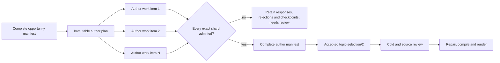

# Bounded author packaging

Date: 2026-09-14  
Program: `standalone-topics/5`  
Status: implemented and locally verified; exact-commit gate, real-route qualification and
long-source editorial evaluation remain open

## Problem

`standalone-topics/4` decomposes independent source discovery, but passes the assembled inventory
to one author request. Its input and output still grow with the number of worthwhile discussions.
The author can also fail after all inventory work has settled, leaving no admitted partial
packaging record. A two- or four-hour source must not require one final model answer to carry the
whole candidate portfolio.

This milestone decomposes author packaging. It keeps V4 and its historical request shapes intact.
Whole-portfolio source review and finding repair remain later bounded-reconciliation milestones.

## Program boundary

The new Temporal type is `TopicSelectionWorkflowV5`, with policy `standalone-topics/5` and five
disjoint PydanticAI activity names. V5 reuses the V4 section inventory contract, then inserts a
bounded author plan, author shards and a complete-manifest gate. Cold review, source review, repair,
compile and render retain their V4 behavior after that gate.

The controlled experiment operator can select V5. The web continues to start V3. V5 cannot become
a production default until its exact request suite is qualified and its real-source output is
reviewed.

## Deterministic author plan

Code reads the accepted `topic-opportunity-inventory-manifest/1` and its exact section plan. It
groups opportunities by their section-prefixed ownership ID, preserves inventory order and splits
each section into work items of at most 12 opportunities. The resulting
`topic-author-packaging-plan/1` records:

- the exact source-index and inventory artifact hashes;
- the immutable maximum of 12 opportunities per work item;
- a global ordinal and section-local batch ordinal;
- the target section and exact ordered opportunity IDs; and
- a deterministic work-item ID such as `section-0004:author-0002`.

Twelve is an output-shape safety envelope, not a video count or duration rule. A candidate may cross
the work item's section boundary when its assigned discussion requires setup, completion or a
meaning-changing follow-up. Section and batch boundaries assign model work; they do not become edit
boundaries.

## Author loop and ownership

Up to three author work items run concurrently. Each request contains the compact source-index
overview, frozen audience rubric, one work item and only its assigned opportunity records. It must:

1. browse every leaf of the target section in order;
2. use hybrid retrieval at least once;
3. read every supplied evidence span and any exact surrounding speech needed for a complete
   candidate;
4. reread all source spans cited by the final answer; and
5. return every assigned opportunity exactly once, in order, with no added opportunity.

The author may change only `candidateIds`, `disposition` and `dispositionReason` on an inventoried
opportunity. Every candidate ID begins with `<work-item-id>:candidate:`. Every candidate must be
referenced by an assigned opportunity, and every referenced candidate must exist in that shard.
This prevents one batch from silently editing another batch's decision.

The author may combine several assigned opportunities when one focused standalone treatment really
delivers them together. It may not combine opportunities across work items in this stage. If the
inventory divided one discussion across work items, the independent source review and later
reconciliation must identify and merge it. That explicit correction is safer than allowing two
independent author calls to race over one candidate identity.

Every continuation uses the existing `topic-agent-checkpoint/1` compactor. Known transient failure
recovery reloads the exact work-item checkpoint. Unknown outcomes retain the existing no-replay
fence.

## Admission and complete-manifest gate

A settled answer becomes either:

- `topic-author-packaging-shard/1`, containing its exact work item, generator family and admitted
  selection subset; or
- `topic-author-packaging-shard-rejection/1`, containing the settled response, work item and exact
  diagnostic.

Admission reruns ordinary candidate and opportunity grounding, exact inventory preservation,
work-item opportunity order, candidate namespace and complete candidate mapping checks. A response
whose indexed inspection omitted the target section, hybrid retrieval or any cited exact sentence
is rejected.

`topic-author-packaging-manifest/1` exists only when every plan work item has one exact admitted
shard in plan order. Assembly reloads each artifact, reruns admission and refuses missing, foreign,
reordered or duplicate candidate identities. It records every generator family that participated.
The independent reviewer is refused if its family participated in author packaging.

Only then does code publish the ordinary `topic-selection/2` record used by the established cold
review, source review, repair, compiler and renderer. An empty inventory deterministically produces
an empty complete manifest without inventing an author call or family.

## Qualification identity

The optional `--suite topic-selection-v5` pre-flight has the same five conceptual stages as V4.
Its inventory shard, cold, source and patch shapes remain explicit; its author stage changes to
`topic-selection-author-shard/1`. The suite renders one exact bounded author work item, exposes only
the three indexed source tools to it, applies the production checkpoint compactor and validates the
answer through production shard admission.

A V3 or V4 report cannot qualify the changed V5 author request. No provider was called during this
implementation.

## Local evidence and limits

Pure tests cover section-preserving 12-opportunity chunking, exact inventory projection, candidate
namespace refusal, missing assignment refusal, complete ordered assembly and missing/reordered
shard refusal. A pathological four-hour fixture with 2,400 six-second sentences and one opportunity
per sentence creates 206 section-preserving work items; no item contains more than 12 opportunities,
the rendered author request contains no later inventory entries or transcript body, and it is under
30 KB.

Connected workflow tests prove inventory → author plan → author shard → author manifest →
selection → source review ordering. A refused author shard stops before source review and never
publishes a selection. An empty inventory produces the complete empty manifest without an author
call. The exact five-stage mocked V5 pre-flight passes, and PydanticAI/Temporal registration
contains one disjoint activity set.

These checks prove finite request shape, provenance and failure behavior. They do not prove that 12
is the best quality/latency tradeoff, that the model packages opportunities well, or that the final
videos satisfy a human editor. Whole-portfolio source review can still grow with the full candidate
and opportunity set. Repair can still receive all required findings at once. Those two stages are
next.

## Next ordered milestone

Decompose independent source review into section-owned candidate/opportunity judgments and exact
overlap/handoff reconciliation work. Every candidate must receive one internal-structure review so
the measured compound-candidate failure is observable. A complete assessment must require every
planned local and relationship shard before any finding authorizes repair.
