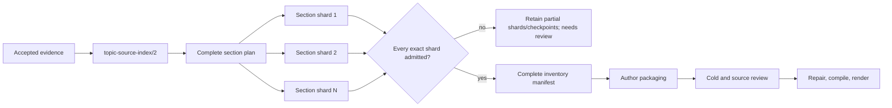

# Bounded opportunity inventory

Date: 2026-09-14  
Program: `standalone-topics/4`  
Status: implemented and exact-commit gate passed; real-route qualification and long-source
editorial evaluation remain open

## Problem

`standalone-topics/3` removed the transcript body from the model request and gave the inventory,
author and source reviewer bounded index tools. Its independent inventory still ends as one model
answer for the whole recording. The final checkpoint must retain every exact sentence cited by
that answer. This is workable for some sources, but its final evidence and output grow with every
worthwhile discussion. A four-hour recording must not depend on one model retaining and returning
the complete opportunity map in one call.

This milestone decomposes independent opportunity discovery. It does not yet decompose author
packaging or whole-portfolio source review; those are the next reconciliation stages.

## Program boundary

The existing workflow and policy remain `TopicSelectionWorkflow` and `standalone-topics/3`.
Historical requests keep their source-wide inventory prompt and complete root-then-sections browse
rule. The new path is a separate Temporal workflow, `TopicSelectionWorkflowV4`, with policy
`standalone-topics/4` and disjoint PydanticAI activity names. V4 is available to the controlled
experiment operator. The web continues to start V3 until V4's exact request suite has been
qualified and its real long-source behavior reviewed.

V4 retains the V3 author, cold-review, source-review, repair and compiler semantics. It changes the
pre-author inventory stage and freezes that change in the run's program manifest.

## Deterministic plan

The accepted `topic-source-index/2` episode has ordered section children. Code converts those
children into one immutable `topic-opportunity-inventory-plan/1` artifact. Every work item records:

- the section ID and ordinal;
- its exact inclusive sentence ownership span; and
- the previous and next section IDs.

A section contains at most eight regions, and each region normally contains at most 32 sentences.
The normal ownership envelope is therefore at most 256 sentences. One oversized source sentence
remains the documented source-index exception. Section boundaries partition inventory work; they
are never proposed video boundaries.

The plan depends on the exact evidence and source-index artifacts. Admission rebuilds it from the
index and compares the complete value and content hash before it is used.

## Ownership and cross-edge discussion

One opportunity belongs to the section containing the earliest sentence in its `coreSpans`. Its ID
must start with `<section-id>:`. This gives every discovered discussion one deterministic owner and
makes duplicate shard output detectable without guessing from titles.

Setup, completion and meaning-changing follow-ups may cross the section edge. The model can search
the full source and read exact speech outside its target section. Ownership remains with the
earliest core sentence. A discussion that starts in one section and finishes in the next is one
opportunity in the left shard; the next shard must not emit it again merely because it contains the
answer. The later author may still create whatever contiguous candidate extent the full evidence
requires.

## Model loop and admission

Each planned section becomes one verifier-seat model call with stage
`verify:selection:inventory:<section-id>`. Up to three section calls run concurrently. Provider
admission, route concurrency, dispatch count, budget reservation, receipt settlement and route
fallback remain the shared harness mechanisms.

The request includes the compact source-index overview, frozen rubric and one target work item. It
requires the model to:

1. browse that section's leaf regions from cursor zero through the final page;
2. use hybrid search to follow concrete themes;
3. read exact source speech for every returned span; and
4. reread all cited ranges immediately before the typed final answer.

Every continuation is rebuilt from the original request and one `topic-agent-checkpoint/1`.
Earlier assistant and tool prose are removed. A known provider failure reloads the exact latest
checkpoint; an unknown outcome keeps the existing no-replay fence.

Section admission applies the normal search/read replay checks and a scoped chronological browse
check for exactly the target section. It then applies the existing opportunity-inventory rules,
the ID prefix, and earliest-core ownership. A settled response becomes either:

- `topic-opportunity-inventory-shard/1`, with its response and inspection dependencies; or
- `topic-opportunity-inventory-shard-rejection/1`, retaining the response, section and exact
  diagnostics.

An execution limit leaves completed shards and checkpoints retained. It does not manufacture a
rejection for a request that was never settled.

## Complete-manifest gate

The workflow passes the exact ordered shard references to a deterministic assembly activity. The
activity requires one shard for every plan section, in plan order. It verifies source-index and plan
hashes, artifact type and content hash, reruns section ownership admission, and refuses duplicate
opportunity IDs.

Only a complete set produces `topic-opportunity-inventory-manifest/1`. The manifest contains the
plan identity, ordered section IDs, exact shard references and the assembled `TopicSelectionDraft`
with zero candidates. Loading it later re-reads all shards and reproduces the manifest rather than
trusting its parsed shape.

If any section is missing, rejected, reordered or foreign, no manifest exists and the author is not
called. The run ends `needs_review` with the retained partial work named in its execution message.

## Identity and qualification

The run manifest for V4 contains five model shapes:

| Stage | Seat | Prompt/schema |
| --- | --- | --- |
| `topic_inventory_shard` | reviewer | `topic-opportunity-inventory-shard/1` / `topic-selection-draft/2` |
| `topic_author` | author | existing author `/8` / `topic-selection-draft/2` |
| `topic_cold` | reviewer | existing cold `/3` |
| `topic_source` | reviewer | existing portfolio `/11` / `topic-selection-portfolio/4` |
| `topic_patch` | author | existing patch `/11` |

The optional pre-flight accepts `--suite topic-selection-v4` and renders the exact section prompt,
tools, native schemas and checkpoint compactor. No V3 qualification report proves V4's changed
inventory request. No route was called or qualified during this implementation.

## Local evidence and limits

Local tests establish that a deterministic 2,400-sentence, four-hour fixture produces 10 ordered
work items, with no normal section above 256 sentences. A shard can own a core at the final sentence
of one section and cite completion in the next. Wrong prefixes and wrong anchors are refused. The
manifest refuses missing and reordered shards. Scoped inspection accepts a complete target-section
browse while the V3 whole-hierarchy rule rejects the same trace. A connected workflow test proves
plan → shard → manifest → author ordering, and another proves that one refused shard prevents the
author call.

The clean exact-commit gate passed for
`0ca907d7a38c4866f3f95398de9b4c1785b5a80a` at `2026-09-14T14:08:41.556Z`. It included frozen
dependency installation, generated-contract drift checks, the database migration and isolation
suite, the complete web and pipeline build/lint/typecheck/test graph, cold web and pipeline image
builds, and all 18 Playwright image-to-image workflow tests. The pipeline suite reported 1,237
passes and one expected environment skip; the contracts, web and database suites reported 33, 202
and 41 passes respectively.

These tests prove bounded request shape, ownership and failure behavior. They do not prove that a
model finds all worthwhile opportunities, that three-way concurrency is the best latency/cost
choice, or that the resulting videos are editorially satisfactory. Provider qualification must
exercise the exact V4 suite. Real evaluation must include the existing 44-minute source and distinct
two-hour and four-hour sources, with source-wide opportunity labels, cold judgments and playback.

## Next ordered milestone

The assembled opportunity manifest and a large candidate portfolio can still make the author and
source reviewer produce one growing final answer. The next change should decompose author packaging
and independent source review into candidate/opportunity batches, then reconcile them through an
immutable complete-plan gate. Internal topic splits must be visible inside a candidate; adjacent
handoff checks alone do not solve the measured compound-candidate failure.
