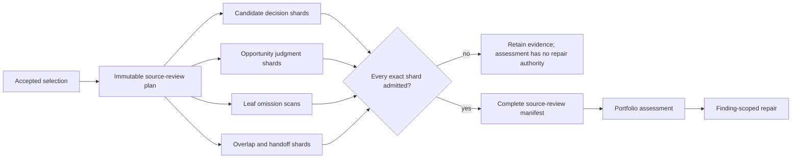

# Bounded independent source review

Date: 2026-09-14  
Program: `standalone-topics/6`  
Status: implemented and locally validated; real-route qualification and long-source editorial
evaluation remain open

## Problem

`standalone-topics/5` bounds discovery and author packaging, but its independent source reviewer
still receives the whole accepted portfolio and must return every candidate, opportunity, overlap,
handoff, omission and finding in one answer. That output grows with the number of discussions. A
late failure also discards review authority after the earlier bounded stages have settled.

The measured Karma defect makes a simple section split insufficient. A reviewer must explicitly
judge the internal structure of every candidate, including a candidate whose one extent has merged
several discussions. It must also compare opportunities, find omissions, and resolve cross-candidate
overlaps and adjacent handoffs. This milestone gives each responsibility finite ownership and
requires a complete manifest before any finding can authorize repair.

## Program boundary

The new Temporal type is `TopicSelectionWorkflowV6`, with policy `standalone-topics/6` and a
disjoint PydanticAI agent set. V6 reuses the V4 bounded inventory and V5 bounded author packaging,
then runs the established cold review per candidate. It replaces only the whole-portfolio source
call with an immutable `topic-source-review-plan/1`, bounded review shards and a
`topic-source-review-manifest/1` gate.

The controlled experiment operator and optional route pre-flight can select V6. The web continues
to start V3. V6 cannot become a production default until its exact request is qualified and human
review establishes its behavior on real recordings.

## Deterministic review plan

Code derives the complete plan from the exact source index and accepted selection before the first
source-review call. The plan binds their hashes and assigns four kinds of work:

| Work kind | Ownership | Maximum answer responsibility | Context authority |
| --- | --- | --- | --- |
| Local candidate | Candidate's first sentence section | 4 candidate decisions | The same candidates and up to 48 linked opportunities |
| Local opportunity | Opportunity's earliest core-sentence section | 12 opportunity judgments | Up to 16 candidates referenced by those opportunities |
| Omission | One exact source-index leaf | Missing discussions whose earliest core sentence is in that leaf | Every candidate intersecting the leaf and every connected opportunity, capped at 16 and 48 |
| Overlap or handoff | Left candidate's first-sentence section | 2 exact candidate pairs | The pair's candidates and up to 48 linked opportunities |

Candidate and opportunity batches preserve accepted portfolio order. Every deterministic overlap
and adjacent handoff from `topic-selection-portfolio/4` is assigned exactly once. One omission scan
is created for every leaf instead of attaching omission authority to an arbitrary candidate batch.
That distinction matters: a scan sees the complete local representation for its exact source
window, so a candidate reviewed in another batch cannot be falsely reported as missing.

The ordinary leaf target is at most 32 sentences and 8,000 source characters. If an unusually
dense selected portfolio puts more than 16 intersecting candidates or 48 connected opportunities
inside one leaf, planning refuses the run instead of silently hiding coverage from the omission
reviewer. Those are review-context limits, not limits on video count or duration.

## Reviewer evidence loop

Up to three source-review work items run concurrently. Each model continuation is reconstructed
from the unchanged bounded prompt and its latest `topic-agent-checkpoint/1`; earlier assistant and
tool messages are removed. The existing request ledger, route fallback rules, checkpoint recovery
and unknown-outcome fence apply to every work item.

The work item itself narrows tool authority:

- `browse_source` accepts only the assigned section and must be paginated from cursor zero through
  completion;
- `inspect_candidate` accepts only the ordered `inspectionCandidateIds` and every one must be
  paginated through completion;
- `search_source` remains source-wide so the reviewer can challenge a local assignment and find a
  distant dependency;
- `read_source` remains source-wide for exact setup, completion and relationship evidence; and
- `read_media_evidence` exposes only already-measured sensor facts and never claims playback.

Every work item must use hybrid search and reread every cited sentence before answering. An
omission item must read every sentence in its exact `sourceSpan`. The final checkpoint therefore
proves source-window coverage and retains all speech that authorizes the typed answer.

Local candidate items return one `select`, `decline` or `unresolved` decision for each exact
candidate. The prompt explicitly asks whether the extent contains one coherent discussion and
requires an `unfocused_extent` finding for a compound treatment. Local opportunity items return one
judgment for every exact opportunity. Relationship items copy their supplied spans and pairs
unchanged before classifying them under the existing V4 semantics.

## Shard admission

A settled response becomes either an admitted `topic-source-review-shard/1` or a
`topic-source-review-shard-rejection/1` with its exact diagnostic. Admission requires:

- no duplicated cold-review candidate judgments;
- the exact ordered candidate, opportunity, overlap and handoff assignments;
- empty arrays for every judgment class the work item does not own;
- finding IDs under `<work-item-id>:finding:` and missing-opportunity IDs under
  `<work-item-id>:missing:`;
- every finding's candidate and opportunity references inside the work item's inspection/context
  authority;
- every opportunity judgment's candidate IDs inside the inspected candidate set;
- missing opportunities only from omission work, with the earliest core sentence inside the exact
  scan span;
- a reviewer family that did not participate in author packaging; and
- a valid source inspection whose browses, searches, candidate inspections, exact reads, checkpoint
  dependency and cited sentences replay against the accepted artifacts.

Admission projects unowned portfolio fields to typed `unresolved` values only while applying the
existing global V4 validator. That projection is never published as a reviewer judgment. It lets
the same grounding and relationship rules validate one bounded shard without pretending that the
shard decided work owned elsewhere.

## Complete-manifest and repair gate

Assembly accepts exactly one admitted shard per planned work item in plan order. It reloads and
hash-checks every artifact, reruns shard admission, refuses foreign or duplicate judgments, restores
candidate and opportunity order, restores deterministic overlap/handoff order and applies the full
portfolio validator to the assembled answer. The manifest records all reviewer families, response
artifacts and source-inspection artifacts.

An assessment receives source-review authority only from that complete manifest. When any shard is
invalid, unavailable or stopped by an execution limit, the run retains its settled responses,
checkpoints, admitted shards and rejections, records that bounded review is incomplete, and sets the
assessment's repair authority to false. A finding from a partial shard therefore cannot change a
candidate. The established repair loop starts only after the entire independent review has one
replayable source of truth.

## Qualification identity

The optional `--suite topic-selection-v6` pre-flight retains the V5 bounded inventory and author
requests and replaces the source stage with `topic-selection-source-shard/1`. Its synthetic local
candidate assignment exercises the exact prompt, native schema, source tools, checkpoint compactor,
candidate inspection and production shard validator. Earlier V3, V4 or V5 reports cannot qualify
this changed source-review request.

No provider, GPU, deployment or staging system was called while implementing this milestone.

## Local evidence and limits

The focused suite currently reports 45 passing tests across source-review planning/admission,
connected V6 workflow behavior and exact qualification. Ruff, the full Python type check, contract
format/lint/type checks and generated-schema drift checks pass.

The clean repository gate passed for exact commit
`234cd9929a5bf144baa1db4e14894aa4b181e646` at `2026-09-14T15:29:51.984Z`. It included 1,256
passing pipeline tests with one intentional skip, the full monorepo check and build graph, fresh
production web and pipeline images, and all 18 Playwright workflow tests.

A pathological four-hour fixture contains 2,400 six-second sentences and 1,200 one-sentence
candidates. It produces 10 sections, 75 leaves and 1,078 bounded review work items: 403 local
candidate/opportunity items, 75 omission scans and 600 adjacent-handoff items. The largest rendered
prompt is 20,242 bytes; the mean is 9,605 bytes. No prompt contains the transcript body or a distant
candidate outside its context authority.

This fixture proves finite request shape and exact assembly behavior. Its 1,078 calls also show that
boundedness does not mean low cost for an unrealistic high-cardinality portfolio. Real call count,
latency, tool behavior, omission recall, compound-candidate detection and human video quality remain
measurement requirements. The next growing final-answer stage is repair: one patch request can
still receive all required findings and affected candidates at once.

## Implemented follow-up

`standalone-topics/7` now decomposes repair into deterministic connected components of required
findings, affected candidates and opportunities. Each indexed component has exact finding and source
authority. Code applies the complete set in one atomic revision only after proving the returned
candidate and opportunity writes are disjoint. Missing, rejected or conflicting components keep the
prior selection. Contract:
[bounded-atomic-repair-2026-09-14.md](bounded-atomic-repair-2026-09-14.md).
