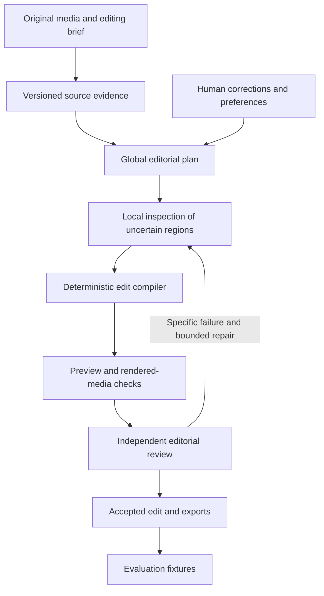

# Temnia: S2 implementation review and proposed AI editing harness

Date: 2026-09-07  
Status: review and design proposal; implementation changes are not authorized by this document.  
Reconciled 2026-09-08: the architecture is adopted in design with amendments, not fully implemented. The fourteen second-review fixes are implemented on `fix/s2-review-findings`; original findings include partial mitigations and explicit deferrals. See the [implementation status and measured live GPU result](harness-implementation-status-2026-09-08.md) for the code/design distinction and remaining specification inconsistencies.
Scope: PR #20's S2 implementation, the proposed editing harness, improved requirements, evaluation, reliability, and unit economics.

Navigation: [implementation issues](#3-issues-in-the-current-implementation) · [stack](#4-stack-i-would-choose) · [architecture](#5-proposed-architecture) · [model selection](#6-perception-and-model-selection) · [cost and recovery](#7-cost-and-recovery-design) · [requirement changes](#8-requirements-i-would-improve) · [evaluation](#9-evaluation-and-release-proof) · [implementation order](#11-proposed-implementation-order).

## 1. Recommendation

Build Temnia around **versioned source evidence, a model-driven editorial planner, and a deterministic edit compiler**, running on Python and Temporal. Optimize for excellent edits with little human correction, measured against the total cost of producing an accepted result.

Several existing stack choices remain appropriate. The largest improvement is how those components cooperate: preserve evidence, distinguish uncertainty from failure, reuse completed work, choose precise cuts jointly, verify rendered output, and make corrections cheap.

The coverage lane remains the first proof: every part of a source belongs to exactly one kept chapter or an explicit drop. Moments and the other editing lanes reuse that chapter spine and its source evidence. Coverage and moments have different constraints; intentional overlap between moments must not be rejected by a chapter-only rule.

This document challenges the PRD and sprint plan where a better design is justified. Recommendations here are proposals, not amendments to the accepted decision records. Model and provider candidates are not production winners; deployment-specific eligibility and measured auditions decide routing.

## 2. Review provenance and limits

- Original reviewed snapshot: PR [#20](https://github.com/TemniaHQ/temnia/pull/20), branch `feat/s2-transcript`, commit [`2a5b763`](https://github.com/TemniaHQ/temnia/commit/2a5b763caf5f194724957cd316ff83d9a7ce8c64).
- Documentation-pass committed snapshot: [`cba4e54`](https://github.com/TemniaHQ/temnia/commit/cba4e544a3404dad614898abb668bff0d5357b78). Three intervening commits fix the Torch wheel index, update Modal CLI/token guidance, and add a regression assertion.
- During the documentation pass, `modal_app.py`, `test_modal_app.py`, and `docs/runbooks/staging.md` sat in this checkout's index and working tree at their `2a5b763` content, byte-identical to the reviewed commit and reversing the three intervening commits. That was not a separate work stream: the branch reflog shows the three commits were made from this checkout, so the files had been checked out back to `2a5b763` afterwards, most likely while citations were being validated. They were restored to HEAD on 2026-09-07 with nothing lost. Finding I01 distinguishes the committed fix from that stale state.
- Independent recheck on 2026-09-07 at `cba4e54`: I02, I07, I08, I12, and I13 were reproduced by direct execution (the WhisperX 3.8.6 constructor signature fetched from the pinned tag; the normalizer and scorer functions run with the inputs quoted in each finding). I03, I04, I05, I06, I09, I10, I11, I14, I19, I20, I27, I29, I30, and I32 were confirmed by reading the cited code at HEAD. The remaining UI and operations findings were not re-executed.
- Code citations below identify the original reviewed commit unless stated otherwise. They remain stable if the branch moves again.
- The review used source inspection, dependency/API checks, and targeted local reproductions. It did not establish production GPU throughput, actual provider bills, or a successful real-media staging release. The documentation pass rechecked source locations; it did not rerun the full release gate or launch paid workloads.
- Findings distinguish **confirmed defects**, **validation gaps**, **robustness risks**, and **product/design improvements**. A risk is not presented as a reproduced incident. Proposed verification is future work unless explicitly described as a review reproduction.
- Browser failure scenarios were reviewed from the React state/effect code; the direct speaker-membership reproduction exercised the TypeScript functions. No new browser sweep was performed for this document. Local reproduction inputs were synthetic/fixture data, not customer media.
- P1 means address before trusting real processing or accepted artifacts; P2 means material robustness, quality, or usability work; P3 means an improvement with lower immediate release impact. Priorities are proposed review judgments.

## 3. Issues in the current implementation

### 3.1 Release compatibility, publication, and retry correctness

**I01 — P1 — The reviewed Modal image requests an unavailable Torch build. Confirmed dependency defect; status changed after review.**

Torch 2.8 is requested from the `cu124` index, which does not carry that release. Image installation fails, and both media functions share the image. This existed at `2a5b763`, was fixed to `cu126` in committed `949196f`, and received a regression assertion in `cba4e54`. A stale checkout of the file at `2a5b763` was briefly staged in the working tree during documentation and has since been restored to HEAD; the committed HEAD does not contain this defect. Evidence: [image dependency configuration](https://github.com/TemniaHQ/temnia/blob/2a5b763caf5f194724957cd316ff83d9a7ce8c64/apps/pipeline/src/temnia_pipeline/modal_app.py#L107), [Torch installation matrix](https://pytorch.org/get-started/previous-versions/#v280).

Fix/verification: retain a published compatible dependency combination, resolve and build the actual inference image, and test package availability and import compatibility. A test asserting a literal URL alone does not establish image buildability.

**I02 — P1 — The real diarization call uses the wrong keyword. Confirmed API defect; still present.**

`DiarizationPipeline(use_auth_token=...)` does not match pinned WhisperX 3.8.6's `token=...` constructor. A real run reaching this stage raises `TypeError` after recognition/alignment, with potential repeated paid work under the retry classification. A local signature-binding reproduction confirmed the mismatch. Evidence: [constructor call](https://github.com/TemniaHQ/temnia/blob/2a5b763caf5f194724957cd316ff83d9a7ce8c64/apps/pipeline/src/temnia_pipeline/modal_app.py#L350), [pinned WhisperX source](https://raw.githubusercontent.com/m-bain/whisperX/v3.8.6/whisperx/diarize.py).

Fix/verification: use the pinned API and test its actual constructor, followed by a short real speech sample through recognition, alignment, and diarization. Treat incompatible arguments as deterministic failures rather than repeatedly attempting paid processing.

**I03 — P1 — Concurrent corrections can overwrite the accepted revision's bytes. Confirmed publication race.**

Two editors read revision N and construct the same N+1 object key. A uploads and commits; B uploads to that key and then loses the database comparison. B sees a stale-edit rejection, but A's accepted pointer now serves B's bytes. Metadata may still describe A's body. Evidence: [upload before compare-and-swap](https://github.com/TemniaHQ/temnia/blob/2a5b763caf5f194724957cd316ff83d9a7ce8c64/apps/web/app/actions/transcript.ts#L232), [unconditional object PUT](https://github.com/TemniaHQ/temnia/blob/2a5b763caf5f194724957cd316ff83d9a7ce8c64/apps/web/lib/transcript/queries.ts#L79).

Fix/verification: allocate unique immutable candidate keys, then atomically publish the winner's reference; collect rejected objects later. Apply equivalent publication rules to machine revisions. Coordinate simultaneous saves with barriers around reads, PUTs, and SQL updates; assert that the accepted bytes, hash, and metadata remain unchanged after the loser finishes. The existing sequential stale-save test does not exercise this ordering.

**I04 — P1 — Retrying a committed claim can strand the transcript in processing. Confirmed idempotency defect.**

If the claim transaction commits and its acknowledgment is lost, the retry sees `processing` and returns zero even for the same workflow. `NotClaimable` is raised before the workflow's failure handler, leaving the transcript processing. The review's repeated-claim reproduction returned attempt 1 and then 0. Evidence: [claim SQL](https://github.com/TemniaHQ/temnia/blob/2a5b763caf5f194724957cd316ff83d9a7ce8c64/apps/pipeline/src/temnia_pipeline/db/__init__.py#L284), [workflow handler boundary](https://github.com/TemniaHQ/temnia/blob/2a5b763caf5f194724957cd316ff83d9a7ce8c64/apps/pipeline/src/temnia_pipeline/workflows.py#L210).

Fix/verification: persist a stable execution/claim token, return the existing attempt to the same claimant, and fence later writes against that token. Inject a lost acknowledgment after commit; the same execution must resume successfully while another claimant is refused.

**I05 — P1 — A failed remote status read can launch duplicate GPU work. Confirmed recovery defect.**

The runner starts another execution after a status-read exception. Provider adapters also conflate transport failures with authoritative computation failure. A healthy remote call can therefore be duplicated, and shared raw-output keys can receive competing results. Duplicate spawning was reproduced during the review. Evidence: [runner recovery](https://github.com/TemniaHQ/temnia/blob/2a5b763caf5f194724957cd316ff83d9a7ce8c64/apps/pipeline/src/temnia_pipeline/transcription/runner.py#L93), [speech status adapter](https://github.com/TemniaHQ/temnia/blob/2a5b763caf5f194724957cd316ff83d9a7ce8c64/apps/pipeline/src/temnia_pipeline/transcription/modal_whisperx.py#L110), [transcode adapter](https://github.com/TemniaHQ/temnia/blob/2a5b763caf5f194724957cd316ff83d9a7ce8c64/apps/pipeline/src/temnia_pipeline/transcode/modal_client.py#L124).

Fix/verification: retain and reconcile the remote handle; represent outcome uncertainty separately; allocate outputs by actual execution identity. Disconnect during spawn/status and lose a completion response. Require reuse of retrievable work, one accepted artifact, and explicitly metered ambiguity where remote idempotency is unavailable.

**I06 — P1 — Retried finalization duplicates transcription usage. Confirmed accounting defect.**

Finalization unconditionally inserts `transcription_seconds`; no event uniqueness constraint prevents retry duplication. The review's repeated finalization of one 60-second run produced two entries totaling 120 seconds. A test that collapses ledger rows into a dictionary by kind can hide this. Evidence: [ledger insert](https://github.com/TemniaHQ/temnia/blob/2a5b763caf5f194724957cd316ff83d9a7ce8c64/apps/pipeline/src/temnia_pipeline/db/__init__.py#L435), [ledger schema](https://github.com/TemniaHQ/temnia/blob/2a5b763caf5f194724957cd316ff83d9a7ce8c64/packages/db/src/schema/media.ts#L216).

Fix/verification: unique usage-event identity incorporating execution/attempt and event kind, with idempotent insertion. Run finalization repeatedly and concurrently; assert event counts and exact totals. Separate accepted-result usage from all billable provider attempts, including failed ones.

### 3.2 Transcript and temporal evidence

**I07 — P1 — Malformed provider output can become successful empty speech. Confirmed validation defect.**

Missing or malformed `segments` becomes an empty list, and malformed segment/word objects are silently dropped. A direct probe of `{"unexpected":123}` returned a valid empty transcript. Nonempty segment text can also disappear if word alignment is missing. Separately, an early transcript ending is assumed to be silence rather than checked against speech evidence. Evidence: [normalization entry](https://github.com/TemniaHQ/temnia/blob/2a5b763caf5f194724957cd316ff83d9a7ce8c64/apps/pipeline/src/temnia_pipeline/transcription/normalize.py#L236), [draft extraction](https://github.com/TemniaHQ/temnia/blob/2a5b763caf5f194724957cd316ff83d9a7ce8c64/apps/pipeline/src/temnia_pipeline/transcription/normalize.py#L100).

Fix/verification: validate raw shape before normalization; preserve unaligned text and distinguish true no-speech from invalid/truncated output. Test missing/wrong fields, malformed words, nonempty unaligned segments, genuine silence, and empty or truncated recognition over independently detected speech.

**I08 — P1 — Interpolating missing timestamps manufactures misleading durations. Reproduced defect.**

The loop mutates one draft before filling the next. Two untimed words between 500 and 2500 ms become `[500,2500]` and `[2500,2500]`. The second has no duration; captions, seeking, and future cuts inherit false precision. Evidence: [interpolation loop](https://github.com/TemniaHQ/temnia/blob/2a5b763caf5f194724957cd316ff83d9a7ce8c64/apps/pipeline/src/temnia_pipeline/transcription/normalize.py#L165).

Fix/verification: process whole missing runs between original anchors, bounded by segment evidence, with explicit uncertainty. Test consecutive missing words, partial endpoints, zero-valued anchors, leading/trailing runs, crossing anchors, and completely unaligned segments. Do not guarantee precise times where the evidence cannot support them.

**I09 — P1 — Sorting alignment times rewrites recognized language. Reproduced defect and contract issue.**

Sorting by `(startMs,endMs)` changes lexical order. A committed fixture's `That is` becomes `is That`, and a test currently expects that reordering. The altered text then reaches readers, captions, segmentation, and model prompts. Evidence: [sort](https://github.com/TemniaHQ/temnia/blob/2a5b763caf5f194724957cd316ff83d9a7ce8c64/apps/pipeline/src/temnia_pipeline/transcription/normalize.py#L242), [fixture assertion](https://github.com/TemniaHQ/temnia/blob/2a5b763caf5f194724957cd316ff83d9a7ce8c64/apps/pipeline/tests/test_transcription_normalize.py#L147).

Fix/verification: retain lexical identity/order and a separate temporal lookup representation. Revise the contract's ordering promise deliberately; repair or flag time regressions instead of silently rewriting words. Assert text conservation, temporal lookup behavior, and overlapping-speaker handling together.

**I10 — P2 — Equal-start speaker turns acquire the wrong words. Reproduced membership defect.**

Two differently labelled words starting at 1000 ms create two turns, but timestamp-based grouping returns `[[],[0,1]]`. The first turn disappears as an addressable group, and reassigning the second changes both words. Paragraph display consumes the same grouping. Evidence: [turn membership](https://github.com/TemniaHQ/temnia/blob/2a5b763caf5f194724957cd316ff83d9a7ce8c64/apps/web/lib/transcript/utterances.ts#L48).

Fix/verification: derive membership from explicit word ranges or contiguous lexical speaker runs. Test tied starts across two/three speakers, overlapping intervals, ordinary boundaries, paragraph rendering, and the actual reassignment result.

**I11 — P1 — Sentence and paragraph ranges can exclude their own speech. Reproduced span defect.**

SaT takes the last word's end instead of the maximum extent. Words `[0,3000]` and `[1000,1100]` yield a sentence/paragraph ending at 1100, under-covering speech by 1.9 seconds in the example. Paragraph packing propagates the problem. Evidence: [sentence extent](https://github.com/TemniaHQ/temnia/blob/2a5b763caf5f194724957cd316ff83d9a7ce8c64/apps/pipeline/src/temnia_pipeline/substrate/sat.py#L222), [paragraph extent](https://github.com/TemniaHQ/temnia/blob/2a5b763caf5f194724957cd316ff83d9a7ce8c64/apps/pipeline/src/temnia_pipeline/substrate/sat.py#L276).

Fix/verification: cover the maximum child extent and retain overlap metadata. Test nested/crossing intervals, speaker changes, and paragraph transitions. Preserve frozen legacy parity separately from the corrected production representation. A valid semantic span still needs a separate safe-cut assessment.

### 3.3 Substrate, evaluation, and reproducibility

**I12 — P1 — Pk/WindowDiff use an inconsistent window size. Reproduced scorer defect.**

The emitted representation marks internal cuts, but the window calculation treats marker count as segment count. For 100 units with a cut at 50, the implementation returns window 50; half the mean of the two segment lengths is 25. Sparse chapter scoring is particularly affected. Evidence: [boundary representation](https://github.com/TemniaHQ/temnia/blob/2a5b763caf5f194724957cd316ff83d9a7ce8c64/apps/pipeline/src/temnia_pipeline/evals/segmentation.py#L105), [window calculation](https://github.com/TemniaHQ/temnia/blob/2a5b763caf5f194724957cd316ff83d9a7ce8c64/apps/pipeline/src/temnia_pipeline/evals/segmentation.py#L135).

Fix/verification: make representation and segment-count conventions consistent. Test the full report path from boundary construction through scoring, with zero, one, and many internal cuts, rather than only handcrafted strings carrying a terminal marker.

**I13 — P1 — Greedy tolerant matching undercounts valid boundary pairs. Reproduced scorer defect.**

Globally choosing nearest pairs does not maximize match count. References `[10000,20000]`, hypotheses `[19000,29000]`, tolerance `10000` produce one match although two are possible. Purity, coverage, F1, and future promotion decisions can therefore be wrong. Evidence: [matching function](https://github.com/TemniaHQ/temnia/blob/2a5b763caf5f194724957cd316ff83d9a7ce8c64/apps/pipeline/src/temnia_pipeline/evals/segmentation.py#L150).

Fix/verification: maximum-cardinality ordered matching, optionally minimizing distance second. Add this counterexample and compare exhaustive small cases against an oracle, including ties, unsorted inputs, and exact tolerance edges.

**I14 — P2 — Some recorded configuration does not describe execution. Confirmed configuration defects.**

An explicit `target_per_hour=0` falls through `or DEFAULT_TARGET_PER_HOUR` and becomes six. Separately, configurable `jump` is recorded although KernelCPD forces it to one. Evidence: [zero default](https://github.com/TemniaHQ/temnia/blob/2a5b763caf5f194724957cd316ff83d9a7ce8c64/apps/pipeline/src/temnia_pipeline/substrate/factory.py#L115), [backend invocation](https://github.com/TemniaHQ/temnia/blob/2a5b763caf5f194724957cd316ff83d9a7ce8c64/apps/pipeline/src/temnia_pipeline/substrate/backends.py#L254), [KernelCPD implementation](https://centre-borelli.github.io/ruptures-docs/code-reference/detection/kernelcpd-reference/).

Fix/verification: default only on missing values; validate finite parameter ranges; reject ineffective options or choose an algorithm that implements them. Test factory/CLI inputs and recorded effective configuration together.

**I15 — P2 — Model names and offline mode do not make builds reproducible. Confirmed provenance gap.**

Model loaders/fetches omit immutable snapshot revisions while provenance records model names and library versions. Two clean builds can fetch different weights despite runtime offline mode. Evidence: [model fetch](https://github.com/TemniaHQ/temnia/blob/2a5b763caf5f194724957cd316ff83d9a7ce8c64/apps/pipeline/scripts/fetch_models.py#L56), [backend loading](https://github.com/TemniaHQ/temnia/blob/2a5b763caf5f194724957cd316ff83d9a7ce8c64/apps/pipeline/src/temnia_pipeline/substrate/backends.py#L131).

Fix/verification: pin weights, tokenizer, and adapters to immutable snapshots, hash artifacts, include them in cache keys, and verify during image build. Test clean rebuild identity and deliberate missing/mismatched artifacts.

**I16 — P2 — The current benchmark cannot establish production chapter quality. Confirmed evidence gap; evaluation redesign proposed.**

Legacy/SaT candidates largely describe turns/pauses, while change-point candidates describe sparse topic changes; all are scored against chapter gold. This can compare raw chapter-proposal strategies, but cannot establish better sentence or paragraph segmentation. The fixture README says real recordings remain pending and identifies a constructed rugby-to-finance transition. Evidence: [report comparison](https://github.com/TemniaHQ/temnia/blob/2a5b763caf5f194724957cd316ff83d9a7ce8c64/apps/pipeline/src/temnia_pipeline/evals/segment_report.py#L158), [fixture limits](https://github.com/TemniaHQ/temnia/blob/2a5b763caf5f194724957cd316ff83d9a7ce8c64/apps/pipeline/tests/fixtures/substrate/README.md#L45).

Fix/verification: evaluate sentences, turns, chapter proposals, and acoustic cuts separately. Compare proposal strategies across density/precision/recall curves and real human annotations. Treat fixed six-per-hour density as an experimental control, not an inferred editorial optimum. Include homogeneous sources, subtle shifts, recurring topics, and long non-speech spans.

**I17 — P2 — The substrate is an offline library/evaluation output, not yet a persisted product artifact. Confirmed integration gap.**

Construction is used by the segmentation report; the transcription activity registration does not build or publish a revisioned substrate. Durable IDs for downstream production consumers are therefore not established merely by having the segmenter library. Evidence: [report construction](https://github.com/TemniaHQ/temnia/blob/2a5b763caf5f194724957cd316ff83d9a7ce8c64/apps/pipeline/src/temnia_pipeline/evals/segment_report.py#L157), [registered activities](https://github.com/TemniaHQ/temnia/blob/2a5b763caf5f194724957cd316ff83d9a7ce8c64/apps/pipeline/src/temnia_pipeline/transcription/activities.py#L268).

Fix/verification: before the harness consumes IDs, persist immutable layers keyed by source/transcript revision, configuration, and model snapshot. Choose eager or demand-driven building explicitly. Test concurrent consumers, correction invalidation, restart/replay, and exact historical retrieval. This is a required integration step, not proof that offline library work has no value.

**I18 — P2 — Language and scale limits lack qualification and recovery. Confirmed limitations; mitigation is design work.**

The default MiniLM model card identifies English and truncation beyond 256 wordpieces; the embedding path has no language routing or truncation check. KernelCPD refuses more than 10,000 sentences only after embeddings have been computed. Neither limitation proves every non-English or long input fails, but the supported envelope is unmeasured. Evidence: [embedding path](https://github.com/TemniaHQ/temnia/blob/2a5b763caf5f194724957cd316ff83d9a7ce8c64/apps/pipeline/src/temnia_pipeline/substrate/backends.py#L198), [scale guard](https://github.com/TemniaHQ/temnia/blob/2a5b763caf5f194724957cd316ff83d9a7ce8c64/apps/pipeline/src/temnia_pipeline/substrate/backends.py#L241), [MiniLM model card](https://huggingface.co/sentence-transformers/all-MiniLM-L6-v2).

Fix/verification: audition multilingual embeddings, detect truncation, preflight limits before inference, and benchmark worker memory/time under concurrency. Provide bounded hierarchical handling or an explicit recoverable supported-input limit. Test long sentences, code-switching, near-ceiling inputs, and continuity across windows.

### 3.4 Transcript usability and recovery

The following UI defects were confirmed from state/effect wiring. Except for the directly executed speaker-membership functions, the documentation pass did not rerun them in Playwright; browser verification below remains required.

**I19 — P1 — Queued state includes permanent dead ends. Confirmed dispatch/state defect.**

Retry commits `pending` before connecting to Temporal; initial child-start errors can be swallowed; no-audio sources never start transcription. Missing/pending rows all display queued without recovery. Older sources lacking a transcript row have the same problem. Evidence: [retry dispatch](https://github.com/TemniaHQ/temnia/blob/2a5b763caf5f194724957cd316ff83d9a7ce8c64/apps/web/app/actions/transcript.ts#L85), [audio/start branches](https://github.com/TemniaHQ/temnia/blob/2a5b763caf5f194724957cd316ff83d9a7ce8c64/apps/pipeline/src/temnia_pipeline/workflows.py#L168), [queued state](https://github.com/TemniaHQ/temnia/blob/2a5b763caf5f194724957cd316ff83d9a7ce8c64/apps/web/lib/transcript/state.ts#L154).

Fix/verification: durable dispatch intent and reconciliation; explicit no-audio, launch-failed, queued, and running states. Simulate Temporal unavailable after commit, initial dispatch failure, a no-audio video, and an older source. Require truthful state and a working recovery path.

**I20 — P2 — Download “Try again” does not initiate a fresh request. Confirmed effect dependency defect.**

After a revision fetch fails, `router.refresh()` preserves the client component. Its fetch effect depends on the unchanged URL, so another fetch is not triggered. Evidence: [fetch dependency](https://github.com/TemniaHQ/temnia/blob/2a5b763caf5f194724957cd316ff83d9a7ce8c64/apps/web/components/sources/transcript-reader.tsx#L115), [retry button](https://github.com/TemniaHQ/temnia/blob/2a5b763caf5f194724957cd316ff83d9a7ce8c64/apps/web/components/sources/transcript-reader.tsx#L312).

Fix/verification: explicit refetch state with cancellation/timeout. Fail the first request, permit the second, click retry, and assert both the new request and rendered transcript.

**I21 — P2 — Virtualization can discard unsaved correction text. Confirmed lifecycle risk; browser reproduction required.**

The draft lives inside an editor that unmounts when its row leaves the virtualizer's retained range. The parent does not retain the draft text. Scrolling away, or playback following elsewhere, can therefore lose an unsaved correction. Evidence: [editor state](https://github.com/TemniaHQ/temnia/blob/2a5b763caf5f194724957cd316ff83d9a7ce8c64/apps/web/components/sources/transcript-word-editor.tsx#L43), [virtual rows](https://github.com/TemniaHQ/temnia/blob/2a5b763caf5f194724957cd316ff83d9a7ce8c64/apps/web/components/sources/transcript-reader.tsx#L475).

Fix/verification: store drafts above virtual rows, keyed by revision/stable word identity; suspend follow while editing and preserve conflicts. Test scrolling far away/back during an unsaved edit and playback following while an editor is open.

**I22 — P2 — Save exceptions bypass inline recovery. Confirmed missing error handling.**

Word/speaker saves and retry can throw on network/storage/database failures without restoring the intended client state or showing an actionable inline error. Speaker reassignment also ignores unsuccessful non-stale results. Evidence: [save handlers](https://github.com/TemniaHQ/temnia/blob/2a5b763caf5f194724957cd316ff83d9a7ce8c64/apps/web/components/sources/transcript-reader.tsx#L199), [retry handler](https://github.com/TemniaHQ/temnia/blob/2a5b763caf5f194724957cd316ff83d9a7ce8c64/apps/web/components/sources/transcript-panel.tsx#L95).

Fix/verification: typed failures plus defensive exception handling, retained drafts, and distinction between rejected and unknown-outcome saves. Test failure before dispatch, server storage failure, and response loss after commit; refetch an ambiguous save before creating another revision.

**I23 — P2 — Failure text can diagnose the wrong problem and promise nonexistent recovery. Confirmed state-model defect.**

Failures other than unsupported language are described as service unavailability, including invalid provider output. Retrying/stalled states promise recovery without checking whether a workflow remains active. Evidence: [failure mapping](https://github.com/TemniaHQ/temnia/blob/2a5b763caf5f194724957cd316ff83d9a7ce8c64/apps/web/lib/transcript/state.ts#L88), [recovery promise](https://github.com/TemniaHQ/temnia/blob/2a5b763caf5f194724957cd316ff83d9a7ce8c64/apps/web/lib/transcript/state.ts#L109).

Fix/verification: persist typed error categories and allowed recovery actions: invalid output, language, resource limit, unavailable service, cancellation, dispatch failure, and operator intervention. Test text/actions for each, including a terminal workflow with stale database state.

**I24 — P2 — Exact phrase search should be part of the transcript foundation. Product improvement.**

Search deliberately performs per-word substring matching. Quotes and multiword names need normalized character matching mapped back to word spans; embeddings are not a prerequisite. Evidence: [search implementation](https://github.com/TemniaHQ/temnia/blob/2a5b763caf5f194724957cd316ff83d9a7ce8c64/apps/web/lib/transcript/paragraphs.ts#L136).

Verification: phrases across punctuation and paragraphs, Unicode, repeated matches, navigation, and corresponding playback highlights. Keep later semantic search separate from exact matching.

**I25 — P2 — Correction and speaker-merge semantics need expansion. Product/contract improvement.**

Edits reject empty text yet allow a 200-character phrase to replace one timed word, so hallucinated-word removal and ASR split/merge errors cannot be represented properly. The UI's speaker-merge promise changes labels while underlying IDs and caption cue breaks remain separate. Evidence: [word edit contract](https://github.com/TemniaHQ/temnia/blob/2a5b763caf5f194724957cd316ff83d9a7ce8c64/apps/web/lib/transcript/edits.ts#L17), [speaker dialog promise](https://github.com/TemniaHQ/temnia/blob/2a5b763caf5f194724957cd316ff83d9a7ce8c64/apps/web/components/sources/transcript-speakers-dialog.tsx#L27), [label update](https://github.com/TemniaHQ/temnia/blob/2a5b763caf5f194724957cd316ff83d9a7ce8c64/apps/web/app/actions/transcript.ts#L154).

Improvement/verification: explicit transcript delete/split/merge operations, original evidence, timing provenance, and realignment flags; versioned speaker identity mapping or accurate rename-only wording. Test removal, tokenization corrections, undo, cue grouping, and stable downstream references. Transcript text correction is distinct from deleting source media.

**I26 — P2 — Alignment score is presented as recognition certainty. Confirmed semantic mismatch.**

The contract defines an alignment score, but the tooltip tells the user the engine was a percentage sure of the word. Timing/alignment quality and word-recognition probability are different quantities. Evidence: [score definition](https://github.com/TemniaHQ/temnia/blob/2a5b763caf5f194724957cd316ff83d9a7ce8c64/packages/contracts/src/transcript.ts#L31), [tooltip](https://github.com/TemniaHQ/temnia/blob/2a5b763caf5f194724957cd316ff83d9a7ce8c64/apps/web/components/sources/transcript-paragraph.tsx#L194).

Fix/verification: accurately label alignment/timing uncertainty and keep human-reviewed status separate. Test null, interpolated, aligned, and human-corrected cases; calibrate any future recognition-confidence claim independently.

### 3.5 Operations, artifact integrity, and release evidence

**I27 — P2 — Warm Modal containers retain large source scratch files. Confirmed cleanup gap; exhaustion not measured.**

Per-source master/ladder directories remain after success and failure. Reused containers accumulate distinct sources and derivatives. Evidence: [scratch setup and return](https://github.com/TemniaHQ/temnia/blob/2a5b763caf5f194724957cd316ff83d9a7ce8c64/apps/pipeline/src/temnia_pipeline/modal_app.py#L215), [Modal lifecycle](https://modal.com/docs/guide/lifecycle-functions).

Fix/verification: per-invocation temporary directories, `finally` cleanup, explicit caches, and disk headroom checks. Process two large distinct sources plus an injected failure in one warm container; verify scratch remains bounded.

**I28 — P2 — Model lifetimes and batching have no measured memory envelope. Robustness risk, not a reproduced OOM.**

Whisper stays referenced while alignment/diarization models load, with fixed batching and no controlled OOM downgrade. Evidence: [model lifecycle](https://github.com/TemniaHQ/temnia/blob/2a5b763caf5f194724957cd316ff83d9a7ce8c64/apps/pipeline/src/temnia_pipeline/modal_app.py#L331).

Improvement/verification: release completed-stage models or maintain a measured bounded cache, checkpoint intermediate outputs, and calibrate batch size plus controlled retry. Measure peak VRAM and latency on representative long/noisy recordings and consecutive warm runs before choosing GPU size.

**I29 — P1 — The local gate and boot version check do not exercise the real speech path. Confirmed validation gap.**

The worker validates a version constant. That function does not load the speech models or carry the real speech/storage secrets. A recorded-provider/CPU gate can pass despite I01/I02 or inaccessible model assets. Evidence: [worker preflight](https://github.com/TemniaHQ/temnia/blob/2a5b763caf5f194724957cd316ff83d9a7ce8c64/apps/pipeline/src/temnia_pipeline/worker.py#L65), [version function](https://github.com/TemniaHQ/temnia/blob/2a5b763caf5f194724957cd316ff83d9a7ce8c64/apps/pipeline/src/temnia_pipeline/modal_app.py#L378).

Fix/verification: retain the cheap compatibility check and add a release smoke test of actual image construction, storage, gated model access, speech processing, and publication. Follow with the real long-source scale run. Deliberately remove credentials or use incompatible arguments and require failure before release acceptance. Mock tests remain useful for deterministic CI.

**I30 — P2 — Ladder reuse trusts incomplete artifact evidence. Confirmed integrity gap.**

The reuse check trusts manifest durations and master-playlist existence without verifying child playlists/segments. Missing or truncated children can leave a supposedly reusable ladder unplayable. Manifest-last publication is useful but does not detect later partial loss. Evidence: [stored ladder validation](https://github.com/TemniaHQ/temnia/blob/2a5b763caf5f194724957cd316ff83d9a7ce8c64/apps/pipeline/src/temnia_pipeline/transcode/__init__.py#L135).

Fix/verification: persist an inventory with sizes/checksums and a bounded integrity-validation strategy. Delete or truncate a child after publication and require a recoverable integrity failure, not successful reuse.

**I31 — P2 — Reported progress and successful-run timing cannot establish real cost or compute liveness. Confirmed observability gap.**

Stage notes begin at zero while the poller heartbeats its last note. Successful transcription elapsed time is returned, but failed calls lack equivalent resource accounting and some work precedes the timer. Source duration measures product usage, not actual GPU cost. Evidence: [timing and progress](https://github.com/TemniaHQ/temnia/blob/2a5b763caf5f194724957cd316ff83d9a7ce8c64/apps/pipeline/src/temnia_pipeline/modal_app.py#L324).

Fix/verification: separate poller liveness, remote-stage activity, measurable progress, and stall state. Record attempt-level resource accounting and reconcile provider usage, including failure/cancellation. Test a healthy slow stage, a hung stage, failure after ASR, retry, and cancellation. Do not infer paid throughput from the last successful result alone.

**I32 — P2 — Gate cleanup can terminate another active gate. Confirmed script concurrency risk.**

The stale-run sweep selects all containers matching the gate name prefix without first proving their owning run is stale. A second gate can remove a first gate's live containers. Evidence: [gate sweep](https://github.com/TemniaHQ/temnia/blob/2a5b763caf5f194724957cd316ff83d9a7ce8c64/scripts/local-ci.mjs#L224).

Fix/verification: single-run locking or ownership/liveness records, plus cleanup restricted to proven abandoned resources. Start two gate invocations and verify either safe refusal or isolation; then simulate an abandoned owner and verify selective cleanup. Do not run destructive concurrency experiments against a developer's active gate.

### 3.6 What the current implementation already provides

Useful foundations include the provider seam, Temporal activity/workflow separation, organization-scoped access, transcript revisions, a virtualized reader, deterministic fixtures, legacy comparison tools, manifest-last publication, and cross-language contracts. Keep these where they support the revised design. The review identifies places where their guarantees are incomplete; it does not require replacing the entire stack.

## 4. Stack I would choose

| Area | Choice | Why and decision boundary |
| --- | --- | --- |
| Durable execution | Temporal, with Python editorial/media workers and a TypeScript composition worker | One owner of checkpoints, timers, cancellation, retries, and human review waits. Retain the existing runtime; compare its operating cost before changing deployment model. |
| Model interface | PydanticAI, used for narrowly scoped typed operations | Normalize provider calls, validate outputs, record usage, and support test doubles. Native schema output where verified, tool output where appropriate, domain validation in both cases. |
| Model routing | Vercel AI Gateway initially, behind Temnia's provider adapter | Pin allowed routes and family exclusions per run. Temnia owns policy and hard dispatch budgets. Direct provider escape hatches remain explicit and tested. |
| Media processing | Python, FFmpeg, ffprobe, and PyAV | Original timebases, decoding, proxies, audio analysis, cutting, and export. Keep all media command construction in the media package. |
| Compute | CPU workers plus Modal for burst GPU work | Use CPU for inexpensive signals and GPU for inference/encoding where measurements justify it. Separate media and inference images to reduce dependency coupling. |
| Speech | Replaceable recognition, alignment, and diarization components | Recognition quality, timing accuracy, and speaker quality are separate selection problems. Audition the candidates in section 6. |
| Inexpensive perception | Silero VAD through ONNX Runtime; waveform/energy measurements; PySceneDetect adaptive and fade detectors | Produce cheap reusable evidence. VAD and shot changes propose evidence, not irreversible editorial decisions. |
| State and artifacts | Postgres plus R2 | Postgres owns state, dependencies, accepted pointers, budgets, and audit records; object storage owns large immutable artifacts. Retain forced RLS and organization scope throughout. |
| Schema ownership | Drizzle for database DDL; Zod/JSON Schema for shared contracts; generated Pydantic seam models | Preserve one DDL owner and one cross-language contract source. Domain-specific Python models may be internal without creating a second database schema owner. |
| Edit representation | Temnia's versioned typed edit specification; OpenTimelineIO for interchange | Capture timing, intent, evidence, uncertainty, transformations, and approvals. OTIO provides editorial interchange without requiring Temnia to discard its richer domain record. |
| Rendering | FFmpeg for ordinary cuts/audio; Remotion for graphics and compositions | Avoid a browser-rendering path for a plain chapter cut. Both consume the accepted edit specification; test preview/export agreement. |
| Studio | Next.js, TypeScript, shadcn; transcript and timeline over the same edit specification | Preserve familiar UI infrastructure while investing in review, undo, conflict recovery, and targeted correction. |
| Observability/evaluation | OpenTelemetry, structured cost records, pytest, pydantic-evals, Playwright, media sensors, human-labelled fixtures | Trace individual operations and compare editorial quality, technical validity, recovery, latency, and cost. Add a trace backend when its operational value justifies its footprint. |

Temporal and PydanticAI are compatible choices, but configure a single retry authority. PydanticAI's current documentation warns that Temporal's default unlimited activity attempts can repeatedly execute model requests; nested SDK and transport retries can multiply that exposure. [PydanticAI Temporal integration](https://pydantic.dev/docs/ai/capabilities/durable_execution/temporal/)

Hatchet is a credible alternative durable runtime, and LangGraph offers persistence and graph execution. The reason to retain Temporal is the fit with Temnia's polyglot media jobs, deployment history, cancellation, and long review waits. An additional orchestration framework would need a measured benefit. Direct SDKs are simpler for one vendor; PydanticAI earns its place by handling several families without owning editorial control flow. A self-hosted LiteLLM gateway becomes attractive if routing/control needs justify operating it. [Temporal versioning](https://docs.temporal.io/worker-versioning), [Hatchet Python SDK](https://docs.hatchet.run/reference/python/client), [LangGraph persistence](https://docs.langchain.com/oss/python/langgraph/persistence)

## 5. Proposed architecture

### 5.1 Understand each source once

The foundational evidence record contains original words and lexical order, stable word/span identifiers, word timings and their uncertainty, overlapping speaker intervals, speech and non-speech regions, shots, representative frames, and relevant visual changes. Preserve music, reactions, breaths, and silent demonstrations as evidence even when they have no transcript words.

Every artifact carries input hashes, model/configuration versions, source and transcript revisions, source timebases, and mappings between originals, proxies, and synchronized tracks. Use rational media time where frame/sample accuracy matters; integer milliseconds remain convenient for transcript interchange and display. A summary always points back to original evidence.

Recognition, alignment, diarization, shot analysis, and visual interpretation have separate checkpoints. A failed speaker step reuses a completed transcript. Chunked processing uses context margins and explicit offset reconciliation; speaker identities must be reconciled across chunks rather than concatenated blindly.

Corrections create revisions. Dependency records identify the evidence each downstream artifact consumed. Correcting a name should update affected captions and titles without necessarily redoing speech recognition, chapter discovery, or unaffected renders. Global conclusions may require broader invalidation than a local caption; record that dependency explicitly.

### 5.2 Plan globally and investigate locally

The planner receives the editing brief, source metadata, transcript, and sparse visual evidence. It identifies the episode's argument, story, recurring subjects, and intended audience, then proposes a chapter hierarchy, source-backed transitions, deliberate exclusions, and unresolved questions.

For ordinary podcasts, start with one full-transcript planning call plus sparse visual evidence. For larger sources, use overlapping sections carrying the global outline and relevant prior references. Compare both at matched total cost before making hierarchical processing mandatory. Combine briefing and proposal when one structured call suffices; a fixed number of narrated stages is not an architectural requirement.

Additional inspection targets ambiguous transitions, delayed answers, references to earlier context, overlapping speakers, silent demonstrations, changing slides/actions, and removals that could alter meaning. Include a small independent visual coverage pass so a speech-guided first pass cannot make unspoken events invisible.

Chapter-Llama supports speech-guided frame selection as an economical chaptering technique. It does not establish edit-safe boundary accuracy, and its windowing ablation is not proof that hierarchical processing beats a modern model given the full transcript. [Chapter-Llama](https://arxiv.org/html/2504.00072v1)

### 5.3 Compile semantic intent into precise edits

Models propose semantic spans and select among addressable boundary candidates. Code compiles the decisions into media operations. The boundary selector considers neighboring chapters together, using word timing, speech activity, pause evidence, overlap, shots, and lane constraints. Independent per-clip trimming is insufficient for a partition.

For chapters, enforce chronology, source bounds, complete coverage through kept regions and explicit drops, one shared boundary between neighbors, and consistent source-to-output mappings. Silence removal is an explicit drop; it must not silently disappear from the coverage accounting.

A useful implementation is a monotonic candidate-boundary graph with an objective balancing semantic fit, acoustic clearance, and granularity. Start with a transparent dynamic-programming selector where the constraints permit it. Introduce a more general solver only if real editing operations require one. The objective and weights are calibrated, not inherited constants.

For example, the planner identifies a subject change after a sentence. The compiler inspects nearby speech and shot evidence and chooses a feasible cut. If the semantic transition has no safe nearby cut, preserve context, widen the candidate region, retain continuity, or request review. Do not manufacture timing certainty to force a successful schema result.

Structural validity can be enforced exactly. Whether a cut sounds natural is a measured quality judgment, supported by sensors and review rather than a claim of formal proof.

### 5.4 Verify what the viewer hears and sees

| Check | What it evaluates |
| --- | --- |
| Structural validation | Coverage, chronology, valid references, source/output mappings, captions, and lane constraints |
| Media validation | Decode success, duration, audio continuity, suspicious black/frozen edges, caption synchronization, and render integrity |
| Independent editorial review | Complete thoughts, misleading exclusions, coherent chapters, supported titles, context, and brief adherence |

The editorial reviewer uses a different model family from the planner and receives source evidence plus the actual proposed artifact. Every objection identifies a criterion, an affected range, and an actionable repair. Model approval is evidence, not proof.

Repairs are bounded and local. A failure between chapters four and five reopens that region and its dependents. Repeated failure becomes a visible review item. Use inexpensive review renders while the plan changes, then run appropriate final-file checks after export. Derive explanations from stored decisions where possible instead of requiring another model call.

### 5.5 Make human review part of the engine

The studio supports boundary audition with context from both sides, source-versus-edit comparison, clear removal reasons, restore/merge/nudge actions, selective regeneration, preserved accepted work, durable drafts, undo, and conflict recovery. A failed refresh preserves the previous committed result.

Confidence comes from calibrated evidence and observed outcomes; self-reported model certainty is insufficient. Distinguish factual corrections from style preferences. Keeping conversational pauses may be a preference, while a clipped first word is a technical defect. Accepted corrections become candidate evaluation fixtures with source-level separation between training and holdout sets.

The canonical edit specification includes source and evidence revisions, stable spans, track references, source/output mappings, kept ranges, explicit drops, captions, crop paths, audio operations, template versions, evidence, review status, and applicable consent/synthetic markers. Publish uniquely allocated or content-addressed artifacts first, then atomically publish the accepted database pointer. Garbage-collect abandoned artifacts later.

### 5.6 Extend the same representation to every lane

| Lane | Additional reasoning/evidence | Representative checks |
| --- | --- | --- |
| Chapters | Global structure and topic completion | Exact coverage, shared boundaries, coherent neighboring chapters |
| Moments | Hook, payoff, necessary context, repetition, standalone meaning | Complete thought, grounding, appropriate duration, duplication |
| Tightening | Restorable deletions, pacing, false starts, tangents | Onset preservation, meaning, joins, pace, retained payoff |
| Audio enhancement | Per-track noise/reverb and speech evidence | Loudness, clipping, continuity, before/after listening |
| Captions/translation | Alignment, readable segmentation, glossary, language rules | Synchronization, reading rate, line breaks, semantic fidelity |
| Reframing | Subject tracks, composition, shot boundaries | Subject retention, smooth crop motion, platform safe zones |
| Multicam | Synchronized tracks, speaker activity, available angles | Track alignment, continuity, camera choices, shot rhythm |
| Ad insertion | Topic completion and narrative importance | Feasible boundary, spacing, interruption of a thought |
| Trailers | Ordering, narrative roles, context, spoiler constraints | Join coherence, supported claims, role and brief adherence |
| Best takes | Script-to-take alignment and performance | Script coverage, selected words, continuity at joins |
| Dubbing/voice fixes | Translation, pronunciation, duration, consent | Duration fit, fidelity, consent and synthetic-range evidence |

Each operation declares its inputs, evidence, constraints, validators, and review controls. Source understanding is reused across lanes; lane-specific decisions and checks remain separate.

OpenTimelineIO supplies interchange with other editing tools. FFmpeg handles ordinary edits; Remotion handles compositions benefiting from React. Sharing a specification reduces drift but does not prove preview/export identity: integration tests must compare timing, audio continuity, and visual samples. Include renderer licensing and operating cost in economics. [OpenTimelineIO](https://opentimelineio.readthedocs.io/en/latest/), [FFmpeg filters](https://ffmpeg.org/ffmpeg-filters.html), [Remotion licensing](https://www.remotion.pro/license)

## 6. Perception and model selection

### 6.1 Reopen the speech-engine decision

Audition recognition, word timing, and speakers independently, while measuring the complete user-visible outcome.

| Candidate | Role in the audition | Qualification |
| --- | --- | --- |
| Soniox async | Managed recognition with bundled speaker/language features | Measure words, timing, speakers, correction effort, and eligible data handling. Low published pricing justifies testing managed service directly. |
| Parakeet TDT 0.6B v3 | Efficient open-weight English/European-language route | Its 25-language coverage excludes Hindi. Long-audio claims must be tested on the actual GPU/configuration. |
| Qwen3-ASR | Multilingual open-weight challenger, including Hindi | Recognition and forced-alignment language support differ. The documented forced aligner supports 11 languages and excludes Hindi. |
| Whisper large-v3 / WhisperX | Established baseline and possible winner | Select by current measured outcomes, not prior inheritance or kernel-only throughput. |
| pyannote Community-1 / Precision-2 | Separately replaceable speaker analysis | Compare managed and self-hosted quality/cost, preserve overlaps, and reconcile speakers across long recordings. |

Use verified native timestamps where adequate; apply separate alignment when it improves edit-boundary quality. Preserve difficult or untimed words with explicit uncertainty. Never discard them merely to satisfy a tidy representation. [Parakeet model card](https://huggingface.co/nvidia/parakeet-tdt-0.6b-v3), [Qwen3-ASR model card](https://huggingface.co/Qwen/Qwen3-ASR-1.7B), [pyannote pricing](https://www.pyannote.ai/pricing)

Use CPU-first Silero/ONNX speech activity and ordinary waveform measurements. Use PySceneDetect adaptive/fade detection for inexpensive visual structure, with a learned detector as a challenger if shot errors matter. Neither VAD intervals nor camera cuts define semantic chapters by themselves. [Silero VAD](https://github.com/snakers4/silero-vad), [PySceneDetect](https://github.com/Breakthrough/PySceneDetect)

### 6.2 Audition models by operation

Keep architecture stable while routing winners change. Current candidate families include Gemini 3.8 Flash, DeepSeek V4, and OpenAI's GPT-5.6 family, with smaller and stronger variants competing for bounded tasks and difficult editorial judgments. The live eligible roster can add further families. These are candidates, not claimed performance winners. [Gemini pricing](https://ai.google.dev/gemini-api/docs/pricing), [DeepSeek model documentation](https://api-docs.deepseek.com/quick_start/pricing/), [OpenAI pricing](https://developers.openai.com/api/docs/pricing)

Every seat's audition includes at least three families and open-weight candidates. Verify the actual provider endpoint's retention, schema support, complete request shape, cache behavior, and usage reporting before admitting it. Model names alone do not establish those properties. The verifier excludes the generator's family for that run, including fallback routes.

Start with one bounded request per editorial operation. Escalate ambiguous or consequential cases when evidence warrants it. Compare independent alternative plans before introducing a conversational debate loop. Tune prompts or distill models offline only after accepted edits provide an adequate training/evaluation corpus. Preserve a held-out source set.

## 7. Cost and recovery design

### 7.1 Measure complete cost

The main unit is **cost per accepted source-hour**, alongside human correction minutes. Record source preparation once and incremental cost per additional output. A chapter set, ten moments, and five aspect/language variants have different rendering economics even when source understanding is shared.

Include recognition, alignment, diarization, visual interpretation, input/output/reasoning tokens, cache reads/writes/storage, GPU/CPU/memory resources, cold starts, transfer/storage, failed attempts, retries, rendering, and attributable fixed operating cost. Keep user-facing usage metering separate from provider resource cost.

Published-price illustration, researched 2026-09-07; these are not measured Temnia results:

| Item | Illustration | Limits |
| --- | --- | --- |
| Soniox async transcription | Approximately $0.10/audio-hour equivalent; roughly $0.20 for a two-hour source | Token-based billing; not the complete editing cost or a proven quality winner |
| Modal L4 plus 4 physical CPU cores and 16 GiB | Approximately $1.116/runtime-hour at listed base rates | Excludes transfer, storage, retries, engineering effort, and applicable premiums |
| Same illustrative Modal configuration at 12x real time | About $0.093/audio-hour | Hypothetical end-to-end throughput, not an ASR kernel benchmark |
| Break-even against the $0.10 reference | Better than approximately 11.2x end-to-end real time | Must compare equivalent recognition, timing, speaker quality, and failure costs |

Soniox publishes the async equivalent and bundled features. Modal lists resource rates separately; the example adds L4, CPU, and memory, then divides by hypothetical throughput. Measure the complete processing path before choosing self-hosted inference on price. [Soniox pricing](https://soniox.com/pricing), [Modal pricing](https://modal.com/pricing)

No all-in price or throughput promise is justified before a representative end-to-end benchmark. Choose GPU type by cost per accepted output and latency, including model loading and upload time. Use separate pinned images, immutable model artifacts, bounded concurrency, and controlled scratch storage.

### 7.2 Spend on uncertainty

1. Reuse source evidence and completed artifacts across lanes and revisions.
2. Use inexpensive audition winners for bounded decisions; reserve stronger calls for difficult or consequential regions.
3. Inspect additional video when it can resolve a question; retain independent sparse coverage of silent events.
4. Batch independent local work without repeatedly sending the whole transcript.
5. Keep stable prefixes before variable instructions and measure actual provider cache hits. Provider prompt caching and Temnia result caching are separate mechanisms.
6. Generate cheap review previews while the edit changes; export final quality after the plan stabilizes.
7. Avoid recomputing unaffected descendants after a correction.

Provider caching requires compatible requests and has its own economics and retention constraints. It does not replace application-level result reuse. [OpenAI prompt caching](https://developers.openai.com/api/docs/guides/prompt-caching), [Vercel automatic caching](https://vercel.com/docs/ai-gateway/models-and-providers/automatic-caching)

### 7.3 Enforce budgets before dispatch

Atomically reserve each call's bounded exposure before dispatching parallel work. Apply input/output/reasoning limits, attempt limits, bounded repairs, and queue/resource ceilings. Settle reservations against actual usage; keep a reservation for an unresolved remote outcome. A user-authorized budget increase resumes the existing run with its completed artifacts.

Gateway limits are a backstop. Vercel documents gateway budgets as soft caps and excludes BYOK usage, so they cannot be the sole enforcement mechanism. [Vercel budgets](https://vercel.com/docs/ai-gateway/observability-and-spend/budgets)

### 7.4 Make retry guarantees achievable

A result checkpoint cannot close the crash window between a provider finishing a billable request and Temnia committing its result. Temporal activities therefore require idempotent side effects or an explicit treatment of ambiguous outcomes. [Temporal activity definition](https://docs.temporal.io/activity-definition)

Use durable dispatch intent, unique operation identity, provider operation/idempotency identifiers where supported, immutable result artifacts, and an `outcome_unknown` state where needed. Reconcile unknown work before redispatch. Do not infer a failed remote job from a failed status read.

The target guarantees are no duplicate accepted outputs, reuse of committed results, and bounded/reported ambiguous spend. A stronger promise depends on verified provider idempotency or retrievable operations. Distinguish a repeated request from repeated remote compute, and both from duplicated ledger entries.

## 8. Requirements I would improve

| Current assumption or requirement | Proposed replacement |
| --- | --- |
| Fixed five-stage editorial sequence | Typed inspectable operations whose decomposition is chosen by measured quality/cost; combine redundant calls |
| Zero repeated paid calls after any crash, by checkpoint alone | Reuse committed results; reconcile remote operations; bound and report unresolved spend |
| Fixed chapter density such as six per hour | User-steerable granularity, scored candidates, alternate valid structures, and no forced quota |
| A single gold timestamp or legacy parity proves editorial correctness | Acceptable boundary windows and alternative valid groupings; semantic and acoustic evaluation separately |
| A tidy word timeline requires a timestamp for every word | Preserve uncertainty and lexical order; refine timing locally where a cut depends on it |
| One combined speech stack is the permanent choice | Replaceable recognition, alignment, and speaker components, auditioned on complete outcomes |
| Long-form input can be evaluated mainly with small fixtures | Representative long recordings and real storage/network behavior, plus targeted edge fixtures |
| A green recorded-provider gate establishes GPU readiness | Deterministic CI plus a separate real-provider deployment/scale smoke test |
| Worker heartbeat demonstrates compute progress | Separate worker/poller liveness, remote stage activity, measurable progress, and stall detection |
| Model-reported confidence or a judge score is sufficient | Calibrated signals, explicit uncertainty, actionable review, and measured human agreement |
| Search/correction/recovery can wait for later intelligence | Reliable phrase search, durable drafts, explicit empty/failure states, and conflict-safe corrections in the usable transcript foundation |
| Every segmenter is comparable against one boundary target | Separate sentence, speaker-turn, paragraph, and semantic chapter tasks; compare like with like |
| Preview and export cannot drift because they share a spec | Share the spec and verify timing/media equivalence across the two paths |

## 9. Evaluation and release proof

Start with 20–30 diverse recordings as an initial proposed corpus, then expand with observed failures. Include long podcasts, interviews, webinars, screen demonstrations, overlapping speakers, noisy audio, music, empty/no-speech cases, multilingual and code-switched speech, variable frame rates, and synchronized multi-track material. Keep recordings separate across tuning and held-out evaluation; snippets from one episode must not leak into both.

Annotators mark acceptable boundary windows, alternative chapter groupings, necessary context, severe omissions, and correction reasons. A broad semantic tolerance must never stand in for an acoustically acceptable cut.

| Primary measure | Why it matters |
| --- | --- |
| Human correction minutes/source-hour | Captures whether automation actually saves editing work |
| Edits and boundaries accepted unchanged | Measures readiness of the proposed result |
| Severe context-loss or misleading-edit rate | Measures editorial harm hidden by ordinary segmentation scores |
| Technical cut failure rate | Measures clipped speech, bad joins, and invalid media |
| Total cost/accepted source-hour | Includes retries, preparation, rendering, and wasted attempts |
| End-to-end and tail latency | Captures cold starts, long inputs, queueing, and recovery |

Diagnostics include word error, speaker-attributed word error, omissions, word-timing error distributions, overlap handling, Pk, WindowDiff, tolerant matching at several tolerances, segment tIoU, density, and semantic coherence. Validate scorers against hand-computed examples before making them promotion gates.

Compare three planning approaches on the same recordings and budgets: one full-context planner plus reviewer; global planning plus local refinement; independent alternative plans plus selection. Count visual processing and reasoning tokens along with ordinary text tokens. Promote the approach that improves accepted edits and review time within the cost envelope.

Required recovery scenarios include simultaneous edits, duplicate activity delivery, lost acknowledgments after database commit, lost status reads during healthy GPU execution, cancellation between stages, publication failure, missing child media artifacts, consecutive sources in one warm container, worker deployment during review, and budget exhaustion during parallel dispatch. UI verification includes network failure, no audio, no speech, stale revision, virtualized draft recovery, phrase search, retry, undo, and partial progress.

## 10. Research interpretation

These papers inform design hypotheses; none proves a perfect Temnia harness.

| Source | Useful lesson | Limit |
| --- | --- | --- |
| [Chapter-Llama](https://arxiv.org/html/2504.00072v1) | Speech-guided visual selection and learned chapter proposals are credible economical candidates | Semantic chaptering does not validate phoneme-safe cutting; the windowing baseline discards later context |
| [PODTILE](https://arxiv.org/html/2410.16148v1) | Global episode context and earlier chapter titles can improve consistency and informativeness | Its title-quality improvement should not be reported as improved cut accuracy; boundary WindowDiff remained close to baseline |
| [EditDuet](https://arxiv.org/html/2509.10761v1) | Structured editing actions and actionable artifact critique are useful patterns | The 80.6% result is judge–human agreement, not edit acceptance; short B-roll tasks and expensive exploration are not Temnia unit economics |
| [Crayotter](https://arxiv.org/html/2606.07636v1) | Inspectable evidence, blueprints, traces, and rendered artifacts support selective repair | Small system-level evaluations do not isolate which agents/stages caused the gain |
| [ARC-Chapter](https://arxiv.org/html/2511.14349v1) | Hierarchical and multimodal chapter evaluation deserves an audition | Semantic matching still does not establish precise media boundaries |
| [When F1 Fails](https://arxiv.org/html/2512.17083v1) | Report granularity and density; separate boundary scoring from selection | It does not justify imposing a fixed chapter count |
| [Compute-controlled reasoning comparison](https://arxiv.org/html/2604.02460v1) and [ACL SRW comparison](https://aclanthology.org/2026.acl-srw.1/) | Agent arrangements need fair budget-controlled baselines; results vary by task | Neither reasoning benchmark establishes the best video-editing architecture |

Use the evidence to design auditions. Do not convert supplier benchmarks or an unrelated paper's score into a Temnia product claim.

## 11. Proposed implementation order

1. **Make S2 trustworthy.** Resolve publication races, claim/finalization idempotency, remote uncertainty, normalization defects, and real GPU compatibility. Preserve useful existing interfaces and the original media.
2. **Establish the evidence and edit contracts.** Versioned source evidence, immutable artifacts, dependency-aware corrections, source/output timing, explicit uncertainty, and lane constraints.
3. **Prove one complete chapter workflow.** Global plan, local refinement, joint boundary compilation, render, media checks, independent review, and usable human correction.
4. **Measure quality and economics.** Audition speech and editorial routes on held-out recordings; verify recovery on real services; publish measured cost and correction effort internally.
5. **Extend through shared operations.** Moments, captions, tightening, audio, reframing, synchronized tracks/multicam, and later lanes reuse the proven contracts and review machinery.
6. **Optimize from accepted edits.** Targeted prompt optimization, selective alternatives, routing improvements, and eventual distillation only after the evaluation corpus supports them.

The first milestone is a chapter workflow that can be watched, corrected, resumed, and costed end to end. This document does not approve code changes, replace the existing PRD/stack decisions, or claim the milestone has passed.

## Second review follow-up — 2026-09-08

Rajesh authorized implementation of the second review's fourteen residual findings on the existing
PR #23. The plan was recorded in the PR before code changes:
[`s2-hardening-followup-360-view.md`](../plans/s2-hardening-followup-360-view.md).

| Residual issue | Implemented behavior and regression evidence |
| --- | --- |
| Missing times cross known segment boundaries | Segment start/end anchors participate in interpolation; tests keep the unaligned 10–12 s passage inside that interval, including consecutive missing and partial timings |
| Displayed transcript and edit revision disagree | Loaded bytes and revision update together; edits capture that revision, and a browser test delays revision 2 after a speaker-turn merge |
| Remote OSError/TimeoutError treated as network loss/running | Protocol 4 frames application failures before SDK serialization; tests round-trip real SDK serialized errors and distinguish genuine local transport failures |
| Malformed/empty alignment silently drops speech | Invalid word fields fail, blank alignment falls back to spoken segment text, and explicit nonspeech stays empty |
| Stale retrying and missing-heartbeat rows have no recovery | Liveness is checked before stage wording, with updatedAt as the fallback clock |
| Retry overwrites a newer run or treats unknown status as dead | Only explicit terminal/absent Temporal status permits a snapshot CAS; a unique pending dispatch token owns failure handling and is replaced by worker claim |
| A late save destroys another word draft | Draft IDs own save responses; drafts retain their base revision and need explicit review against newer content |
| Retry action rejection escapes the panel | Typed refusals, network loss, and server errors remain actionable; a rejected cached Temporal connection can reconnect |
| Machine finalization races correction storage accounting | Both paths take the transcript row lock; two real connections verify blocking in both orders and a final 210-byte ledger with no duplicate duration charge |
| Smoke exercises a local ephemeral app | A standalone CLI resolves deployed app/environment handles and checks helper and GPU build identities; wrong/mixed/changed builds fail |
| Stale image cleanup deletes an active run's shared image | Cleanup removes abandoned tags instead of image IDs; a fake Docker listing proves shared-image/live-tag preservation |
| Aggregate HLS bytes mask missing objects | Named sizes, playlist hashes, rendition/init/segment references and byte ranges are checked; corrupt text rejects reuse, while transport failures retain uncertainty |
| Cache/pin check reports different weights than were loaded | Setup and runtime share one effective cache and explicit immutable weight/tokenizer snapshots; provenance stays with the loaded instance, and real model tests run offline |
| Nonpositive min_sentences reaches expensive work | Factory and direct construction reject nonpositive/fractional values before loading/embedding |

The HLS inventory has bounded object/playlist sizes and a five-minute reuse check, with heartbeats
preserving a saved call handle. Old markers without named inventory trigger regeneration. Retained
unreferenced objects are counted in storage rather than deleted while another attempt may be using
them. Media presence/length and playlist hashes are verified; same-size media corruption still needs
cryptographic media-object verification. That is not claimed by this check.

Preflight validation included the full pipeline suite with real models offline, the web unit suite,
strict Python/TypeScript checks, repository lint, and an actual local ffmpeg/storage reuse smoke.
Four additional Playwright tests cover delayed revision loads, all three delayed-save outcomes,
a 27,900-word virtualized transcript, and refused/lost retry responses. The exact-SHA local gate
and production-image browser results are recorded by PR #23's required checks at delivery.

The live GPU smoke and staging scale run remain post-deployment verification. Protocol 4 requires
draining version-3 work before deploying both halves; the runbook specifies the order. This batch
does not deploy or merge the PR, implement S3's edit compiler, or establish exactly-once paid work
across an unknown provider submission acknowledgment.
