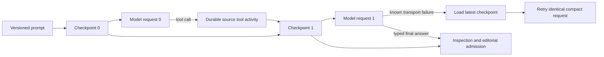

# Indexed editorial agent checkpoints

2026-09-14. This record freezes the first bounded continuation and recovery contract for the
indexed topic-selection roles. It supplements
[indexed-editorial-evidence-2026-09-14.md](indexed-editorial-evidence-2026-09-14.md) and
[topic-source-index-v2-2026-09-14.md](topic-source-index-v2-2026-09-14.md). It records implemented
behavior and local tests. It does not establish provider reliability, editorial quality or tuned
limits for a real two- or four-hour source.

## Problem and decision

Source tools do not solve long-context growth if every model response and tool result remains in
the next request. A long inspection then sends the same transcript excerpts repeatedly, and a
known provider failure can make a restarted agent repeat already-settled discovery calls.

The three indexed roles now use PydanticAI `ProcessHistory` to rebuild every model request from:

1. the unchanged versioned editorial prompt;
2. one application-authored `topic-agent-checkpoint/1`; and
3. only the exact source sentences still retained in that checkpoint.

The full conversational transcript is discarded from the next wire request. The checkpoint is
published before that request can be reserved or dispatched. Each later checkpoint depends on its
immediate predecessor, and the model response depends on the exact checkpoint used for its request.

## Checkpoint contract

`topic-agent-checkpoint/1` is a frozen Pydantic record with:

- source-index SHA-256, editorial role and exact stage;
- zero-based request sequence and the parent checkpoint content hash;
- every successful source-tool call as arguments, returned node/sentence/evidence-event IDs,
  completion state and continuation identity;
- an ordered least-recently-used set of exact source sentences available to the next request; and
- the count of exact sentences evicted from working context.

The call history intentionally keeps no browse descriptions, search hits or source prose. It is the
auditable progress map used to reproduce traversal. Exact retained sentences are the model's current
evidence. Search text is model-authored and bounded by the source tool contract.

The first request has sequence zero and no parent. A successful tool result creates the next
sequence. Rebuilding or retrying a request with no new successful source result preserves the same
sequence, parent and bytes; it does not manufacture progress.

The checkpoint content hash is the canonical JSON SHA-256. Its artifact identity additionally binds
the organization/source scope, run ID, programme version, stage, role and source-index hash. A
checkpoint from another run, stage, role or evidence index cannot be substituted even when its
content happens to match.

## Bounded reconstruction

Every continuation contains exactly one model request message. It has two user parts: the original
prompt and a clearly marked application-authored checkpoint. Previous assistant prose, tool-call
messages and tool-return messages are absent from the wire request. PydanticAI continues to own the
agent/tool loop, while the processor owns what context reaches each model round.

The current safety envelopes are code constants rather than editorial targets:

| Envelope | Current refusal boundary |
| --- | ---: |
| Successful source calls | 256 |
| Returned node, sentence and evidence-event IDs in the progress map | 8,192 |
| Exact sentences in working context | 320 |
| Exact sentence text in working context | 128 KiB |
| Canonical checkpoint bytes | 384 KiB |
| Identical successful call records | 2 |

The oldest exact sentences are evicted first when either exact-text envelope is reached. Call IDs
and the eviction count remain, so the model can see that earlier inspection happened. An identical
third successful call refuses the loop as no progress. A call with a new cursor or different range
is distinct.

These values bound memory and payloads; they are not limits on source duration, video count or video
duration. The present final-answer contract nevertheless requires every sentence in every returned
source span to coexist in the final checkpoint. A portfolio whose required exact speech exceeds the
working envelope must be decomposed before this mechanism can admit it. That bounded portfolio
reconciliation is still a later milestone, so these constants are not claimed as production-tuned.

## Durable publication and retry

Before each indexed model dispatch, `BudgetedModel` publishes the checkpoint as a scoped immutable
`checks` artifact. Sequence zero depends on the prepared call's exact input artifacts. Every later
sequence also depends directly on its parent checkpoint. Missing or mismatched parents fail before
provider dispatch. The response artifact depends on the exact checkpoint as well as the prepared
inputs and records its checkpoint ID and SHA-256.

An HTTP/transit failure with a known outcome keeps the existing ledger behavior: the charge is
settled, the route gets one workflow-owned retry, and then the seat can move to its next qualified
route. For an indexed call the workflow first loads the highest valid checkpoint for that exact
run/stage/role/index, verifies its content hash, prepared inputs and direct parent, and restarts the
agent from those bounded bytes. The processor preserves that checkpoint when no new tool result
exists, so the next attempt has the same compact request. A route change changes the paid route
identity while retaining the evidence state.

An unknown provider outcome is still fenced by the existing ledger and is never converted into a
retry by the checkpoint loader. Temporal replay reuses completed model/tool activities. Checkpoints
do not weaken the operation, attempt, receipt, budget or run-level unknown-exposure rules.

If the inventory exhausts a known execution envelope before a typed result, authoring continues with
the missing independent inventory made explicit and no invented inventory artifact. If author
discovery exhausts it, the run ends without admitting an ungrounded selection. Source-review
exhaustion remains an incomplete assessment. All checkpoint artifacts reached before these outcomes
remain available for audit.

## Final-answer admission

The final compact checkpoint projects to `topic-source-inspection/2`. That source-text-free record
includes the checkpoint hash and sequence, all tool access facts, retained exact sentence IDs and
the eviction count. Admission requires:

- a complete episode-root and every-section traversal;
- at least one hybrid search and at least one exact source read;
- the correct index, role and stage;
- a final sequence after source-tool use;
- unique retained sentence IDs that were actually returned by exact reads;
- every sentence covered by every typed answer span still retained; and
- exactly one direct response dependency whose checkpoint bytes project to the submitted inspection.

Earlier reads that were evicted remain progress evidence but do not authorize a final candidate,
opportunity or review claim. Prompts tell each indexed role to reread all final cited ranges
immediately before answering. This preserves the rule that summaries and stale notes cannot replace
exact source evidence.

Historical uncompacted messages still project to `topic-source-inspection/1` and retain their
original admission behavior. New compacted calls produce v2 inspections; old artifacts are not
reinterpreted.

## Qualification and local evidence

The optional route pre-flight applies the same `ProcessHistory` processor to inventory, author and
source-review calls. A tool/final test confirms that the second physical request contains the prompt
and one checkpoint user message, with no prior assistant or tool message. Every model round remains
a separate qualified dispatch and receipt.

Local tests establish:

- 400 exact six-second fixture sentences can be read across pages while the final request retains
  the most recent 320 and refuses a claim based only on an evicted sentence;
- root, section, search and read tool rounds produce sequences zero through four while every model
  sees one rebuilt request message;
- restarting an agent from sequence four preserves sequence four and the same compact bytes until a
  new successful tool result exists;
- a third identical successful source call is refused;
- database-backed publication creates a run-scoped parent chain and model responses depend on their
  exact checkpoint; and
- route pre-flight performs a compact tool continuation under the existing two-dispatch accounting
  limit.

These are deterministic and mocked-transport checks. No new paid model/GPU call, staging run,
deployment or human editorial evaluation was performed for this milestone.

## Remaining scale work

This checkpoint layer closes unbounded active tool-history growth and known-failure restart within
one indexed seat. Candidate-region and measured-media tool calls now use the same checkpoint and
replay contract; their exact extension is recorded in
[candidate-media-evidence-tools-2026-09-14.md](candidate-media-evidence-tools-2026-09-14.md).
Source-bound index reuse across runs is implemented with explicit evidence, producer,
authorization, retention and per-run use identities; see
[source-index-reuse-2026-09-14.md](source-index-reuse-2026-09-14.md). Independent opportunity
discovery is now decomposed into section-owned calls and one complete-manifest gate; see
[bounded-opportunity-inventory-2026-09-14.md](bounded-opportunity-inventory-2026-09-14.md).
Author packaging and whole-portfolio source review still need bounded reconciliation. Real
44-minute, two-hour and four-hour provider and editorial evaluation
remains the final gate rather than evidence inferred from fixtures.
