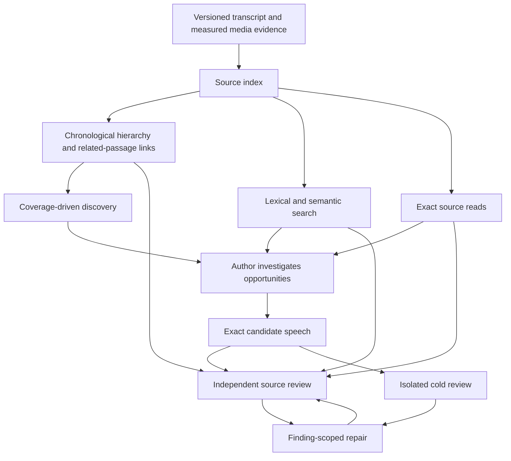

# Indexed evidence for the editorial harness

2026-09-14. Rajesh's direction after reviewing PR #48: a mechanism that sometimes handles a
44-minute transcript is not an adequate foundation for two- or four-hour recordings. Build an
index and give author/reviewer models tools to investigate source evidence. Treat this as a
foundation shared by the editorial roles, rather than W4's late author-only addition.

The first end-to-end vertical slice, hierarchy, durable-checkpoint, reviewer-evidence, safe
cross-run reuse and bounded opportunity-inventory milestones are implemented on
`feat/indexed-editorial-evidence`. They replace
whole-transcript prompts for the independent inventory, author and source reviewer with one
immutable source index and bounded, role-specific tools. This is implemented behavior with
synthetic and local test evidence; it is not a measured editorial improvement or a production
qualification. Author packaging and whole-portfolio review still need bounded reconciliation.

## Why this changes the design

At comparable speech density, two hours contains about 2.7 times the transcript of 44 minutes;
four hours contains about 5.5 times as much. Actual request size also includes sentence metadata,
inventory, selection, schemas and previous tool results. A large context window can admit such
an input without establishing that a model reliably compares every premise and qualification.

The current code already uses `admission/2` and payload-scaled deadlines. Historical one-byte-per-
token refusals and a fixed 540-second ceiling must not be presented as the current architecture.
The 512-KiB request cap and route-specific context/output limits remain. No two- or four-hour
editorial success is established by the admission tests.

The target is bounded work per model request with durable progress across the whole recording.
Total work still grows with source length and the number of candidate discussions. More tool
round trips can cost more than one successful full-context call; lower total cost and better
editorial quality are evaluation questions.

## Implemented vertical slice

`topic-source-index/2` is a scoped, content-addressed `checks` artifact derived from the exact
accepted evidence artifact before any editorial model call. It retains every transcript sentence,
an exact ordered leaf partition and an episode → section → region hierarchy. Every node has
deterministic keywords and first/middle/last previews. Leaf vectors use the already pinned
`sentence-transformers/all-MiniLM-L6-v2` revision; section and episode vectors are normalized,
sentence-count-weighted averages of their children. Text is embedded in at most 800-character
units and averaged into each region vector so later material in a region is not silently discarded
by the encoder's input ceiling. A leaf normally contains at most 32 sentences and 8,000 text
characters, and a section owns at most eight leaves. A single accepted sentence may be larger and
exact reads refuse anything above 64,000 characters.

The model prompt carries only index identity, region/sentence counts, transcript duration and tool
limits plus episode, section and region counts. It contains no transcript body. Inventory, author
and source-review agents receive exactly
`browse_source`, `search_source` and `read_source`; scope, source and index identity come from model
dependencies and cannot be supplied by the model. `browse_source` returns at most 16 chronological
children of one episode or section, `search_source` returns at most 12 BM25/cosine-ranked leaves for a query of at most 512
characters, and `read_source` returns at most 80 exact sentences and 64,000 characters with an
explicit continuation sentence.

V3's three indexed prompts require a cursor-zero browse of every root child followed by every
section's leaves, all in source order and through the final page, plus hybrid search and exact reads.
V4 decomposes the independent inventory into one call per deterministic section. Each call must
browse exactly its owned leaves, while search and exact reads may cross the edge to recover setup or
completion. Author and source-review calls retain the full hierarchy rule until their own bounded
reconciliation milestone.
Each continuation is now rebuilt from the original prompt plus one bounded
`topic-agent-checkpoint/1`; earlier assistant and tool messages are removed. The checkpoint retains
all source access facts and a bounded LRU set of exact sentences. Admission projects its final state
to a no-prose `topic-source-inspection/2` trace. Code verifies the complete browse chain, at least
one search, and exact reads of every sentence in every source span claimed by the final typed
inventory, selection or source review. Every claimed sentence must still be in the final checkpoint,
so an evicted read cannot authorize a decision. The accepted editorial artifact depends on the exact
index, final model response, checkpoint and inspection trace. Cold review remains isolated and repair
keeps its existing bounded, finding-authorized evidence.

PydanticAI executes source tools as Temporal activities with one attempt and a two-minute timeout.
Every model continuation is a separate ledger operation and request hash; a successful tool-call
response settles as a successful paid round rather than being mistaken for final typed output.
The checkpoint is published before dispatch in a run/stage/role/index-bound immutable parent chain,
and each response depends on the checkpoint it saw. After a known provider failure, the workflow
loads the latest valid checkpoint and retries the same compact request on the current or next
qualified route without repeating settled source discovery. Unknown outcomes remain fenced. Final
response admission searches the settled rounds for the unique response that parses to the typed
result. The physical gateway validates the complete role-specific three- or five-tool set on every
wire request. The
optional route pre-flight applies the same compactor and can retain and account for multiple
tool/final rounds under one logical stage.

A deterministic four-hour fixture with 2,400 six-second sentences produces 75 regions in 10
sections. Its initial prompt overview stays below 500 serialized characters, all sections and
regions are reachable through bounded pagination, a rare lexical phrase is retrieved, and exact reads paginate. This proves request-shape
scaling in the local fixture. It does not prove opportunity recall, editorial judgment, production
latency, provider tool behavior or useful four-hour video selection.

The hierarchy makes every leaf descriptor discoverable, but an inventory shard does not read every
original sentence unless it uses that sentence in a returned span. Descriptions are deterministic
source extracts and keywords, rather than model-generated semantic abstracts; relationship links
are not implemented. The checkpoint prevents active tool results from accumulating on the wire, but
its final exact-evidence envelope means authoring and portfolio review still need bounded
reconciliation. V4 assigns each opportunity to the section containing its earliest core sentence,
retains every admitted or rejected shard and assembles a manifest only from the exact complete
ordered shard set. Its contract is
[bounded-opportunity-inventory-2026-09-14.md](bounded-opportunity-inventory-2026-09-14.md).
Index artifacts now use an evidence- and producer-bound stable
identity within one organization/source scope. Every run retains a separate use record, and cache
hits re-read, hash-check and structurally revalidate the accepted artifact before use. The exact
contracts and invariants are recorded in
[topic-source-index-v2-2026-09-14.md](topic-source-index-v2-2026-09-14.md) and
[indexed-agent-checkpoints-2026-09-14.md](indexed-agent-checkpoints-2026-09-14.md). Cache identity,
authorization and invalidation are recorded in
[source-index-reuse-2026-09-14.md](source-index-reuse-2026-09-14.md).

## A source index with both navigation and search

Use two complementary access patterns. An ordered discovery pass accounts for every source
region, including material the agent does not know to search for. Targeted retrieval follows a
particular discussion, antecedent, correction or later return to a subject. Search ranking alone
cannot establish that the inventory contains all worthwhile discussions.

The target hierarchy preserves chronology. A separate set of source-linked hypotheses can connect
recurring discussions and possible question/answer, correction or continuation relationships.
A discussion may recur in several non-contiguous places; those links help inspection but do not
authorize stitching separate passages into a contiguous-only video.

| Layer | Contents | Authority |
| --- | --- | --- |
| Canonical evidence | Exact sentences, words, speakers, timing and source/media identity | Source text and measured facts |
| Leaf regions | Bounded sentence/turn groups, exact owned spans, contextual overlap, neighbor links | Retrieval boundaries, never final video boundaries |
| Regional map | Deterministic descriptions, child-region IDs and bottom-up vectors; anchored claims and unresolved continuations are later work | Navigation hypotheses |
| Episode map | A bounded deterministic overview with paginated section children | Navigation; cannot substitute for source review |
| Search index | Lexical matches and semantic vectors over source-linked regions | Suggestions about where to read |
| Inspection records | Exact source spans delivered to each role and its recorded decisions | Evidence access and progress; not proof of model comprehension |

The implemented index builds section and episode levels bottom-up from bounded leaves. Every node
keeps the identities of its children and the exact source range it describes. Code re-derives every
ownership edge, description and parent vector during admission. No index-building call depends on
fitting the full recording into a prompt. Summaries are never accepted as quotations, selected
speech or proof of closure.

Code verifies complete ordered coverage by leaf ownership. Contextual overlap is allowed without
double-counting coverage. Oversized regions are subdivided; a malformed transcript with an
oversized sentence needs explicit continuation/word-span handling or an unavailable result,
never silent truncation. Chunk edges are computational boundaries that agents can cross.

## Tools and role separation

Start with a small, explicit tool surface:

| Tool | Purpose |
| --- | --- |
| `browse_source(parent_id, cursor)` | Traverse the chronological map and discover pending regions |
| `search_source(query, scope, cursor)` | Find exact phrases and related meanings anywhere in the permitted source |
| `read_source(first_sentence_id, last_sentence_id, cursor)` | Return exact speech with source identity, neighbors and explicit pagination |
| `inspect_candidate(candidate_id, cursor)` | Source reviewer: page through the exact internal regions intersecting one accepted candidate |
| `read_media_evidence(span, cursor)` | Source reviewer: page through already measured speech/shot/alignment evidence when it bears on a claim |

The runtime supplies organization, source, evidence revision and role; models cannot substitute
them as arbitrary tool arguments. Every result names the index/evidence identity, returned spans,
completion state and any continuation cursor. A search with no matches means no matches were
retrieved, not that no qualification exists in the recording.

The independent inventory role browses every leaf descriptor in bounded calls and code requires
exact reads for every speech span it returns. Later hierarchy/reconciliation work should process
the original speech behind every region rather than treating descriptors as proof that no
opportunity exists. The author explores the inventory, reads its actual speech, follows context
and proposes candidates. Missing regional results stay visible; a top-level summary cannot
silently turn incomplete discovery into complete coverage.

The source reviewer starts from the exact candidate and makes its own retrieval decisions. It must
page through every candidate's intersecting regions and read exact speech across internal region
changes. It checks the opening premise, closing qualifications, attribution and internal discussion
structure, and can follow evidence to any part of that same source. It can optionally inspect
already measured media events, which are sensor facts rather than playback. A generated map shared
with the author is a navigation aid, not an independent judgment. The reviewer must have access to
raw regions and must not inherit the author's pass verdict or persuasive rationale. The exact tool,
identity and admission contract is recorded in
[candidate-media-evidence-tools-2026-09-14.md](candidate-media-evidence-tools-2026-09-14.md).

Cold review receives only the selected speech, local IDs and the agreed audience/title policy.
It has no episode map or whole-source search. If a candidate itself exceeds one request's
envelope, its cold review requires bounded continuation over that candidate's speech and an
explicit completion record; it cannot silently review a truncated clip.

Repair can investigate relevant source outside an earlier narrow context window, while mutation
authority stays finding-scoped. Reading a passage does not authorize changing another candidate
or annexing its core. Broader corrections require a grounded finding naming every affected
candidate/opportunity. Combined repairs still require conflict checks and portfolio review.

## Working context and durable progress

The indexed roles now replace PydanticAI's accumulated active message history before every model
request. Each request contains its versioned prompt and one `topic-agent-checkpoint/1` with compact
access facts, unresolved pagination identities and currently retained exact excerpts. Previous
assistant prose and tool results do not cross the wire again. Every new tool result creates a new
checkpoint and request identity; retry without new evidence preserves the prior checkpoint.

Checkpoint artifacts form a direct parent chain and responses name the exact checkpoint they saw.
The workflow can load the latest checkpoint only for the same run, stage, role, index and prepared
inputs after a known provider failure. This supplies bounded recovery across route retry and fallback
without weakening the existing receipt or unknown-outcome fence. The current envelopes and failure
states are frozen in
[indexed-agent-checkpoints-2026-09-14.md](indexed-agent-checkpoints-2026-09-14.md).

Summaries of working notes do not become substitute evidence for a verdict. References needed for a
substantive decision must resolve to exact retained source, and the deciding call must receive the
relevant source text. The current admission rule enforces this by requiring all sentences covered by
final typed spans to remain in the final checkpoint. This closes stale-evidence admission but makes
bounded portfolio reconciliation necessary when all final evidence cannot fit together.

The index is immutable and bound to organization, source, transcript/evidence hash, index schema,
chunking configuration, and any embedding or summary model/prompt versions. Raw indexing work
can be reused across editorial runs with the same identity. Audience-specific discovery and
review decisions additionally bind the rubric; a new audience cannot inherit an old rejection.
Sentence IDs are positional and cannot carry approvals across evidence revisions by themselves.

Keep Temporal as the runtime. The agent loop executes in workflow code; model calls and I/O tools
execute as durable activities. Store large evidence bodies as existing scoped artifacts and use
references across boundaries where supported; design and verify history/payload handling on
the pinned integration rather than accumulating an episode's text in every workflow event.

Each distinct model round has an exact request identity and a linked stage/task identity. Paid
attempts remain attempts of that request; a successful tool-request response is not a failed
final-output attempt. Reserve, settle and replay every model request through the ledger,
including summaries, embeddings if metered, and query embedding calls. Unknown provider
outcomes keep the run-level fence. Already dispatched work can settle; no timer or tool-group
boundary grants permission to dispatch again while exposure remains unresolved.

Use request and tool-result envelopes, pagination, progress checkpoints and duplicate-query
detection to keep work bounded. Persistent no-progress, missing evidence and exhausted configured
resources produce an explicit partial/unavailable state. Select operational limits from measured
workload and route behavior; the old proposed eight-round cap is not an established default,
and computational envelopes must not become fixed video counts or duration quotas.

## How this addresses the editorial defects

The index makes internal structure observable: a candidate can contain multiple regional
discussions even when it overlaps no other candidate. Source review should explicitly account
for the internal units and decide whether they form one viewer purpose or require a split.
This brings the compound-candidate problem into the programme instead of hoping adjacent
handoff checks will discover it. Topic shifts and embedding change-points remain scored hints;
they do not automatically define exports.

Distant setup and qualifications become retrievable. Evidence passed to each judgment becomes
inspectable. Repairs can request missing information before editing. Saved indexing and small
requests may improve reuse and recovery. None of these mechanisms guarantees source-faithful
selection: the models can still miss a relationship or misjudge what makes one discussion.
Physical cut safety, meaningful prompts, independent criticism and human calibration remain
separate requirements.

## Alternatives and implementation sequence

| Approach | Assessment for Temnia |
| --- | --- |
| Full transcript per seat | Retain as a measured baseline where admitted; increasing limits alone does not demonstrate reliable long-source judgments |
| Fixed windows alone | Useful bounded scan units, but discussions and dependencies cross their edges |
| Flat semantic top-k retrieval | Useful targeted lookup; insufficient as the discovery/omission mechanism |
| Chronological hierarchy + hybrid search + exact-read tools | Chosen direction; the three-level hierarchy, hybrid leaf search and exact-read tools are implemented |
| Full entity/community GraphRAG | Relevant global-search ideas, but a separate graph stack is not yet justified for one recording; a chronology with typed links is the smaller comparison |

Sequence the next design around this foundation:

1. Freeze source-bound human labels and baseline request/latency/cost evidence; include
   worthwhile unselected discussions and distant-dependency cases.
2. Implement immutable index construction, source tools, bounded context and the durable
   model/tool request lifecycle as one coherent vertical slice. Hierarchical index construction,
   tools, multi-round accounting, cold-review isolation, bounded reconstruction and known-failure
   recovery are implemented and locally tested.
3. Move independent discovery, authoring and source/portfolio review onto the shared mechanism.
   Mandatory candidate inspection, measured-media access and source-bound index reuse are
   implemented. Independent discovery is now one admitted shard per section with a complete-manifest
   gate. Author packaging and source/portfolio review remain to be decomposed; neither can be one
   unbounded dump of every opportunity or candidate.
4. Compare on real full recordings around 44 minutes, two hours and four hours, with repeated
   runs and separate held-out sources. A four-hour recording is a test requirement; it has not
   been verified as available in this session. Repeated/copied transcripts test payload handling,
   not editorial quality at that duration.
5. Use the observed remaining failures to prioritize repair decomposition and adjudication.
   Resolve PR #48's shared-authority and accounting issues before either change.

The implemented slices now name the index, checkpoint, inventory plan/shard/manifest,
candidate/media and inspection artifact
contracts, scoped tool arguments and results, model continuation/final-response behavior,
known-failure recovery and route validation. Real long-source provider and editorial recovery remain
open. PydanticAI's support did
not make the gateway path capable by itself; model history processing, admission, persistence,
workflow retry and the physical wire validator were changed and tested.

The first retrieval baseline is source-local Okapi BM25 plus exact cosine search over the pinned
MiniLM vectors stored in the existing artifact system. That is an implementation baseline, not a
retrieval-quality winner. Compare it using actual sentence counts, concurrent-source load and
multilingual retrieval quality before adding a reranker or database index. A source index does not
inherently require a new vector database service. Previously planned Voyage and reranking choices
still require current task-specific comparison. Drizzle owns any future database DDL.

## Validation and operations

Measure peak request size, total tokens, index cost separately from recurring run cost, time to
first candidate, completion latency, cache reuse and settled/unknown expense. Editorial measures
include source opportunity recall, missed setup/qualification rate, internal-split correctness,
duplicate core, human acceptance and correction effort. Retrieval hit rate is a diagnostic, not
the editorial acceptance score. Reuse the existing source/evidence/rubric-bound evaluation
contracts; uncollected human observations remain unknown.

Exercise empty and noisy transcripts, oversized regions, multilingual/coded-switching speech,
cross-region questions and answers, a correction hours later, recurring topics, no worthwhile
exports, unavailable index components and interruption after any paid response. Verify scoped
tool reads, transcript injection staying data, paginated completeness, exact evidence delivery,
cold-review isolation and replay without duplicated paid work. A failed semantic index must be
reported; deterministic source traversal can continue where possible without pretending search
quality is unchanged.

Index builds publish only complete immutable component manifests; partial work is resumable and
cannot masquerade as a complete source map. A new transcript creates a new index identity. Scope
cache keys and artifacts by organization/source/revision, and retain referenced versions for
in-flight runs. Schema/prompt/tool-version changes follow the existing programme identity rules.
Use existing deployment automation for any new worker capability. User states should identify
indexing, discovery, context review, partial coverage and missing evidence, without claiming that
regions processed is a percentage of editorial quality.

## Research basis and limits

- [Lost in the Middle](https://arxiv.org/abs/2307.03172) found position-dependent performance
  on long-context retrieval tasks in the models it tested. This motivates evaluation of context
  use; it does not establish a failure rate for Temnia's current routes.
- [RAPTOR](https://arxiv.org/abs/2401.18059) evaluates retrieval through a hierarchy of
  recursively generated summaries. It supports comparing multi-level navigation, not treating
  generated summaries as faithful cut boundaries.
- [Anthropic's contextual retrieval experiments](https://www.anthropic.com/engineering/contextual-retrieval)
  compare contextualized lexical and embedding retrieval. That supports a hybrid-search
  comparison; its QA results are not Temnia editorial acceptance measurements.
- [GraphRAG global search](https://github.com/microsoft/graphrag/blob/main/docs/query/global_search.md)
  uses hierarchical reports with bounded map/reduce work for global questions. The useful lesson
  is explicit global processing alongside local lookup, without assuming Temnia needs its graph.
- [PydanticAI's Temporal documentation](https://pydantic.dev/docs/ai/capabilities/durable_execution/temporal/)
  places agent coordination in workflows and model/I/O tool work in activities. Temnia already
  uses this integration, but its ledger/gateway restrictions still need deliberate adaptation.
- [Anthropic's context-engineering guidance](https://www.anthropic.com/engineering/effective-context-engineering-for-ai-agents)
  describes managing tool results and retained notes over long tasks. Bounded context and durable
  exact evidence are proposed here as complementary responsibilities.

Local evidence: current `harness/models.py`, `routes.py`, `gateway_policy.py`, topic selection
prompts/workflow, substrate sentence/change-point code and evaluation contracts. Consulted the
legacy `pipeline-architecture.md` for its whole-plan review/recut lesson and cached-full-
transcript design; neither its architecture nor its old acceptance figures select this design.
