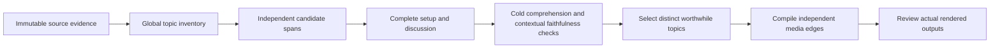

# Standalone topic videos: diagnosis and research

Research date: September 10, 2026. Audience: Rajesh and the engineers implementing Temnia's
editorial harness. Status: evidence-backed diagnosis and proposed implementation direction;
**no new editorial implementation or quality win is claimed by this report**.

The subsequent [implementation record](standalone-topic-implementation-2026-09-10.md) describes
the program now added to this PR. Rajesh requested PySceneDetect AdaptiveDetector for the next
harness trial; detector superiority and standalone editorial acceptance remain unmeasured.

Rajesh clarified the job: extract interesting discussions from a long recording that can be
published independently on YouTube or Facebook. Two videos may reuse surrounding source context
when that improves standalone quality. A custom prompt should be optional. There is no requested
duration, output-count, or research-spend cap. This clarification supersedes the earlier requirement
that the exported topic videos themselves form a disjoint exact cover.

## Findings and direct answers

**The principal problem is the editorial objective and the program that implements it.** Temnia
currently produces a valid partition of a recording. That does not guarantee a collection of
worthwhile, complete videos. The legacy implemented several editorial operations that the new
execution omitted or weakened. The full Karma run also exhausted its independent reviewer routes
while repairing proposal references, so it never received an editorial verdict.

| Question | Finding | Confidence and limit |
| --- | --- | --- |
| Is the architecture correct? | Keep the durable runtime, evidence, accounting, immutable revisions and media execution. Change the editorial output contract and judgment sequence. | Structural incompatibility with overlap is proven in validators/compiler. No evidence identifies Python, Temporal or PydanticAI as the cause of the semantic failure. |
| Is the segmentation approach correct? | Sentence segmentation and topic-change proposals are useful evidence. They cannot establish that an independently viewed discussion has enough context and a satisfying resolution. | The Karma claim/correction split demonstrates a bad semantic boundary despite valid sentence and media checks. |
| Are the LLMs wrong? | The selected routes have not been auditioned for standalone quality. Model capability may contribute, but the saved run cannot rank the models fairly. | Different models received different repair roles and inputs. There is no matched standalone-quality audition. |
| Is the prompt ineffective? | It mentions coherent topics, complete thoughts and Q&A preservation, but principally requests source partitioning. It needs an operational standalone rubric and examples. | Prompt improvement alone cannot authorize overlapping spans or create a reviewer that never runs. |
| Why did legacy feel better? | Its actual code contained complete-topic planning, global boundary reconciliation, local semantic cutting, cold clip review and final global revision. | These operations are implemented, not merely aspirational docs. Later raw acceptance measurements were not located; the earlier 18% failure predates these improvements. |
| Will Chapter-Llama solve it? | It can contribute navigation/topic proposals. It is not a demonstrated standalone-discussion editor. | Its training task and evaluation are chapter boundaries/titles, with shared neighboring ends. |
| Has anyone solved this? | Commercial products explicitly target standalone excerpts and completeness; published engineering offers useful methods. | The inspected primary sources do not establish reliable unattended publication readiness on interviews like Karma. |

The earlier emphasis on successful rendering and green checks was insufficient evidence of
editorial progress. This report makes publication readiness the outcome to measure. It does not
replace that measurement with another architecture diagram or an assistant's preferred cuts.

## 1. Evidence and method

The audit inspected current Temnia code at `7dd35ec6d4453ddc526c339615f61660377e8e5b`
(PR #32, subsequently squash-merged as `9bb84560022e6b6a67adf191dcbe0352cb46ddb4`) and the
actual legacy checkout at `b642b774b48ad45910acb168d8dad86796da7e64`. Cited legacy files
were clean relative to that commit. It also examined the retained full Karma proposal responses,
edit, technical checks, usage ledger and post-run source analysis. Primary external sources were
read for methods, evaluations and limitations; product claims are identified separately below.

No new provider calls, competitor uploads, model installations or production changes were made
for this research. No output was manually recut. The retained run is a **diagnostic case**, not a
held-out benchmark: Karma has already been inspected repeatedly during development. Assistant
analysis of its transcript is not human listening acceptance and is not human-authored gold.

Evidence categories used here are: **observed** in source code or saved artifacts; **reported** by
an external author/vendor; **inference** connecting those facts to this task; and **proposed**, which
requires implementation and measurement. The [implementation and experiment plan](../plans/standalone-topic-intelligence.md)
and [deferred backlog](../plans/editorial-research-deferred-backlog.md) keep those distinctions actionable.

## 2. What the complete Karma run actually proved

The input was the complete 43:56 recording, with 6,203 transcript words and 579 sentence units.
The normal workflow used the generic `topic-chapters/1` brief, no custom chapter boundaries and
no Chapter-Llama suggestions. It produced twelve kept videos and proposed dropping the repeated
opening teaser. The latest run ended in `needs_review`, with no accepted revision.

| Observation | Result | Meaning |
| --- | --- | --- |
| Run | `0ecbe3cc-85f4-40ec-b97b-8fa41d800deb` | One attributable autonomous workflow, not an edited demonstration. |
| Elapsed after existing ingest | 6 minutes 34 seconds | Excludes upload, transcription and ladder generation. |
| Provider attempts | 3; two proposal-reference repairs | These were not two successful editorial improvement passes. |
| Technical checks | 204 of 204 passed | The rendered files and deterministic constraints passed their checks. |
| Editorial reviewer | Zero calls; verdict not run | All three available families had become proposal authors. |
| Reported model spend | $0.14417573; ledger rounded to $0.144176 | Zero remaining reservation for this run. Not the total cost of the day's earlier work. |
| Human publication acceptance | Not recorded | Neither technical success nor this analysis supplies that verdict. |

The clearest failure is at **06:22.920**, between videos 2 and 3. The host's sentence `s000078`
frames an assumption that deeper mantra practice neutralizes desires/karma. The next video starts
with the guest's correction, `s000079–s000080`: “Not necessarily. You cannot say neutralized.”
The split leaves the first viewer without the correction and the second without the claim being
corrected. Both sides contain complete sentences. Moving the cut a few milliseconds cannot solve it.

This is an editorial defect that could have been corrected even under the existing partition
contract, for example by keeping the exchange together. Overlap is therefore **not the sole cause**
of this particular failure. It is a separate representational requirement for cases where two
otherwise distinct topics need the same setup.

Other observations require restraint. A 38-second Bruce Lee section has a completed maxim and
commentary before a books introduction; its length alone is not proof of truncation. Three cuts
intersect speech-detector intervals but no aligned word intervals. They are listening risks, not
proof of clipped words. The final video retains the sign-off; retaining it does not establish that
an outro is a worthwhile standalone topic. The opening drop remains proposed, not human accepted.

The first DeepSeek/DeepInfra proposal supplied seven quote anchors outside their proposed sections;
the GLM/Baseten repair supplied one; the Kimi/Alibaba repair satisfied the reference contract. The
route preparation then refused to dispatch a reviewer with
`No independent verifier family remains in the frozen route snapshot.`
These observations establish reference reliability and a routing failure. They do not establish
that Kimi is the best editor or that DeepSeek is the worst: the calls had different jobs and inputs.

The compact [case record](standalone-topic-karma-case-2026-09-10.json) preserves hashes, output
extents, charges and the diagnostic finding without committing the private transcript, media or
provider handles. Full local evidence remains in the paths recorded there; those paths are not
portable artifacts and require the retained files to reproduce the analysis.

## 3. Where the current harness loses the intended task

### A partition is being used as the publication plan

The [default brief](https://github.com/TemniaHQ/temnia/blob/7dd35ec6d4453ddc526c339615f61660377e8e5b/apps/web/lib/harness/default-brief.ts#L5)
asks for meaningful topic chapters, preserving context and questions/answers, while retaining source
content unless explicitly dropped. The [proposal prompt](https://github.com/TemniaHQ/temnia/blob/7dd35ec6d4453ddc526c339615f61660377e8e5b/apps/pipeline/src/temnia_pipeline/harness/prompts/chapter.py#L128)
operationalizes this as ordered keep/drop sections. The [validator](https://github.com/TemniaHQ/temnia/blob/7dd35ec6d4453ddc526c339615f61660377e8e5b/apps/pipeline/src/temnia_pipeline/harness/validators.py#L137)
requires each sentence exactly once, with no gaps or overlap. The edit and compiler use one shared
boundary between neighbors.

That contract is appropriate for navigating the original video and accounting for all source
material. It already allows an introduction or outro to be an explicit drop; it does not require
every section to be exported. Its proven restriction is different: a shared question cannot orient
two videos, and one kept section's ending constrains the neighboring section's beginning. Weak
selection of worthwhile topics is a separate objective and judgment issue. Improving adherence to
the partition contract alone can make the wrong product more reliable.

The recommendation is two representations over the same immutable evidence: an optional source
map for navigation/accounting and a selected set of independently bounded topic videos. Unused
material is explained rather than forced into an export. Reused context is counted rather than
rejected. This is a targeted domain-contract change, not a new orchestration platform.

### Grammatical, acoustic and discourse boundaries are different

SaT supplies addressable sentence units. Embedding change points and Chapter-Llama can suggest
where subjects change. The [compiler's timing costs](https://github.com/TemniaHQ/temnia/blob/7dd35ec6d4453ddc526c339615f61660377e8e5b/apps/pipeline/src/temnia_pipeline/harness/compiler.py#L45)
choose executable cut candidates using displacement and media evidence. None of those establishes
whether a correction completes a preceding claim, a story has resolved, or a new viewer knows what
“that” refers to.

Karma's full proposal input contained all 579 sentences; simple context omission does not explain
this run. Having all text in the request still does not prove that each proposed boundary received
sufficient local reasoning. LongBench v2 evaluates deeper long-context understanding separately
from retrieval; it does not rank Temnia's configured 2026 routes. The relevant design inference is
to combine source-wide understanding with focused original-text inspection, not to impose an
arbitrary context-length threshold. [LongBench v2, ACL 2025](https://aclanthology.org/2025.acl-long.183/).

### The reviewer exists, but the full run could not use it

The [current rubric](https://github.com/TemniaHQ/temnia/blob/7dd35ec6d4453ddc526c339615f61660377e8e5b/apps/pipeline/src/temnia_pipeline/harness/editorial.py#L555)
does explicitly assess setup, answers, source edges and complete thoughts. It also accurately says
that the model has not heard or watched the media. The [editorial workflow](https://github.com/TemniaHQ/temnia/blob/7dd35ec6d4453ddc526c339615f61660377e8e5b/apps/pipeline/src/temnia_pipeline/harness/editorial_workflow.py#L99)
can repair grounded findings and reassess. Thus “there is no semantic verifier” would be false.

The failure is that proposal repairs are allowed to consume every family subsequently excluded
from review. The [authorship-family collection](https://github.com/TemniaHQ/temnia/blob/7dd35ec6d4453ddc526c339615f61660377e8e5b/apps/pipeline/src/temnia_pipeline/harness/editorial_activities.py#L145)
includes previous authors. The route must keep a nonauthoring reviewer available before dispatching
the first proposal. A successful model transport response or structurally valid proposal must never
be presented as editorial approval when that reviewer is unavailable.

There is also a judgment-design gap: the current reviewer sees global sentences alongside the
edit. That helps check source faithfulness but can mask missing context in the clip. This is a
design inference, not an observed reviewer failure in the unreviewed Karma run. A
separate cold-viewer check needs only the actual clip content, followed by a contextual check for
omitted corrections and qualifications. Different-family routing does not itself calibrate either
check; LLM-judge research documents biases and domain-dependent agreement. [MT-Bench judge study](https://arxiv.org/abs/2306.05685).

### Prompt qualification has been mistaken for task qualification

Transport, schema compliance, grounding and editorial competence are separate properties. The
saved route qualification exercised the former properties on small controlled inputs. It did not
measure useful independently publishable topics on fresh full recordings. Repeated field-ID and
timing-arithmetic instructions consume prompt space; whether they reduce editorial attention is
an unmeasured hypothesis.

The proposed prompt should ask for an intelligible purpose, relevant source-supported discussion,
necessary setup and a completed resolution, including explicit uncertainty when that is the
speaker's conclusion. It should not manufacture a dramatic hook, force a definitive answer, or
require users to restate basic editing competence. Code should derive redundant display quotes and
timing fields from selected sentence IDs; semantic evidence IDs still require validation.

GEPA provides a way to optimize prompts from task scores and execution feedback using training and
validation examples. It is useful **after** publication-readiness labels exist. Optimizing against
coverage or boundary similarity alone would reinforce the wrong objective. This is a proposed use,
not evidence that optimization has already improved Temnia. [GEPA official documentation](https://gepa-ai.github.io/gepa/),
[paper, ICLR 2026](https://arxiv.org/abs/2507.19457).

## 4. What the legacy actually did better

The TypeScript system's names are not the lesson. Its implemented editorial operations are.
The real [segment execution path](https://github.com/Mitosia/mitosia-legacy/blob/b642b774b48ad45910acb168d8dad86796da7e64/lib/intelligence/segment-pipeline.ts#L1392)
calls the following operations; this is stronger evidence than an architecture illustration.

| Implemented legacy operation | Editorial purpose | Temnia implication |
| --- | --- | --- |
| Persisted episode brief with source-wide topic spine and setup-inclusive arcs | Remember the source's meaningful complete discussions before cutting. | Add a compact source-specific topic inventory; full transcript presence is not the same representation. |
| Table-of-contents-first rough plan | Distinguish a chapter's development/resolution from a single striking beat. | Specify each candidate's purpose and evidence of completion. |
| Global Reconciler | Remove boundaries at question/direct-answer, backward reference, interjection or supporting example. | Treat a topic-change proposal as a hypothesis, with an explicit keep/remove judgment. |
| Local Cutter | Inspect both neighboring discussions and a sentence reel around a handoff. | Resolve semantic membership before choosing the acoustic edge. |
| Cold standalone review | Judge orientation and resolution from the clip's own text. | Keep this input separate from the source-context faithfulness review. |
| Global Publisher plus verifier | Merge, split, recut or reclassify the final plan and verify the result. | Review the set of candidates for fragmentation, missed topics and redundant core ideas. |

Sources: [brief and TOC contracts](https://github.com/Mitosia/mitosia-legacy/blob/b642b774b48ad45910acb168d8dad86796da7e64/lib/ai/capabilities/episode-clips.ts#L536),
[Reconciler rules](https://github.com/Mitosia/mitosia-legacy/blob/b642b774b48ad45910acb168d8dad86796da7e64/lib/ai/capabilities/episode-clips.ts#L694),
[local Cutter invocation](https://github.com/Mitosia/mitosia-legacy/blob/b642b774b48ad45910acb168d8dad86796da7e64/lib/intelligence/segment-pipeline.ts#L1109),
[cold review input and rubric](https://github.com/Mitosia/mitosia-legacy/blob/b642b774b48ad45910acb168d8dad86796da7e64/lib/ai/capabilities/moment-review.ts#L75),
[Publisher contract](https://github.com/Mitosia/mitosia-legacy/blob/b642b774b48ad45910acb168d8dad86796da7e64/lib/ai/capabilities/segment-publisher.ts#L369).

Chronology matters. The 18% M1 acceptance record preceded the cutting-room commit `ff84b5b`
(August 28), Reconciler `bc8aff0` (August 29) and Publisher `d092cef` (August 30). It must not
be used to dismiss Rajesh's later experience of near-production results. Conversely, no later
raw full-episode gold, output receipt or human-acceptance measurement was located in this audit.
The saved nine-model audition notes are historical observations, not a current controlled ranking.

Some tests that sound like editorial evidence are synthetic. The legacy
[Karma-shaped Publisher test](https://github.com/Mitosia/mitosia-legacy/blob/b642b774b48ad45910acb168d8dad86796da7e64/tests/segment-publisher.test.ts#L155)
supplies a merge over artificial sentence text. It proves compilation of a provided decision, not
that a live model autonomously found it. The same distinction must apply to Temnia's tests.

Legacy chapter outputs also shared cuts and prohibited overlap. Its
[chapter cut application](https://github.com/Mitosia/mitosia-legacy/blob/b642b774b48ad45910acb168d8dad86796da7e64/lib/intelligence/segment-cuts.ts#L17)
preserves ordered starts; the Publisher contract forbids overlapping slices. Independent
[in/setup/payoff/out selection](https://github.com/Mitosia/mitosia-legacy/blob/b642b774b48ad45910acb168d8dad86796da7e64/lib/ai/capabilities/clip-fine-cut.ts#L44)
existed in the moment lane. Context reuse between topic videos is therefore a new requirement,
not a feature that can simply be restored from the old chapter code.

These findings favor restoring and measuring the useful editorial operations in the present typed
runtime. They do not justify copying its punctuation heuristics, vendor choices or orchestration
framework without a fresh comparison.

## 5. What external work establishes

The following sources answer different parts of the problem. Their scores are not interchangeable.

| Source, date | Relevant evidence | Limitation for Temnia |
| --- | --- | --- |
| [Chapter-Llama, CVPR 2025](https://arxiv.org/html/2504.00072v1) | Fine-tuned Llama 3.1 8B predicts chapter starts and titles from ASR plus selected-frame captions. Full-test F1 is 45.3 versus Vid2Seq's 26.7; the ASR-only small ablation is 38.5 versus combined 42.6. | Navigation uses contiguous chapters whose ends are the next starts. The headline multimodal score does not describe the released ASR-only integration or standalone acceptance. |
| [VidChapters-7M, NeurIPS 2023](https://arxiv.org/html/2309.13952v1) | Large-scale creator chapter annotations support navigation-model training. | Creator boundaries are noisy and do not label mandatory setup, corrections or publishable excerpts. |
| [PODTILE, CIKM 2024](https://arxiv.org/html/2410.16148v1) | Podcast chaptering uses global metadata and previous chapter titles to inform local generation. | Supports preserving global context; evaluates browsing/chapters rather than independent-upload completion. |
| [Rhapsody, May 2025](https://arxiv.org/html/2505.19429v1) | Podcast highlights use replay-derived labels; text-plus-audio improves over text in the reported experiment. Best reported F1 is 0.175 on its highlight task. | Replay interest over time bins is not a complete discussion. It neither certifies audio edges nor ranks today's Temnia models. |
| [Sieve engineering, April 2024](https://www.sieve.ai/blog/generate-video-highlights-long-form-content-podcasts) | Its disclosed implementation moved from scoring small segments separately to selecting spans from ordered context, with continuity and complete-idea instructions. | Engineering experience and open code, not a controlled publication-readiness benchmark. Its batch sizes are not defaults to inherit. |
| [Riverside Magic Segments, accessed September 10, 2026](https://support.riverside.com/hc/en-us/articles/29872971315613-About-Magic-Segments) | Automatically creates standalone medium-length excerpts from full recordings, explicitly for repurposing on platforms including YouTube. | Direct product-category match. Its documented 3–10-minute range is Riverside's policy, not a Temnia requirement; no disclosed accuracy measurement. |
| [Vizard Model v2, July 2026](https://vizard.ai/blog/meet-vizard-model-v2-full-context-clips-that-the-algorithm-actually-rewards) | Describes missing setup and early endings as the problem; claims clips include setup, insight and payoff. | Vendor claim without a reproducible acceptance benchmark in the inspected material. Its comparative and distribution claims were not independently verified. |
| [OpusClip rubric, accessed September 10, 2026](https://help.opus.pro/docs/article/virality-score) | Separates hook, flow, value and trend, including a satisfying conclusion. | A proprietary virality score is not calibrated completeness or a reliable performance prediction for Temnia. |
| [Eddie AI interview workflow, July 2026](https://www.heyeddie.ai/blog/how-to-build-a-rough-cut-from-an-interview-transcript) | Source-grounded story selection, timeline creation and review of the cut, with editor finishing. | A useful workflow description, not evidence that unattended extraction is solved. |
| [EditDuet, SIGGRAPH 2025](https://arxiv.org/html/2509.10761v1) | Editor/critic tools and artifact-based pairwise judging; reported 80.6% agreement with human majority. | The evaluation concerns short visual B-roll edits. That agreement cannot be inherited as podcast semantic-verifier accuracy; keyframes cannot hear a cut word. |
| [Crayotter, 2026](https://arxiv.org/html/2606.07636v1) | Traceable plans, tools and artifacts; human evaluation on 23 visual themes. | Supports inspectability, not a causal proof that each module improves standalone interviews. |
| [GRPB editing study, August 2026 preprint](https://arxiv.org/html/2608.02694v1) | Compares alternatives within the same task/materials and splits by source project. | Useful experiment discipline; broad editing tasks and early results do not justify building an RL system here. |

Across these sources, the defensible common pattern is source understanding, selection of connected
content, explicit completion criteria and review of the actual result. It is not a particular number
of agents. The proprietary products do not disclose enough to copy their internals or claim a
controlled competitor victory. Temnia should borrow the problem decomposition and test it.

## 6. Proposed editorial architecture

Use one finite program in the existing runtime. Initially, a topic video is one contiguous interval
from the original source, in its original order. Each video has independent in/out boundaries; two
videos may overlap where necessary. Multi-source montage, reordering and synthesized connective
speech are unnecessary to answer the current question and are outside the first experiment.

The inventory is a compact artifact of source IDs and topic relationships, not a graph database or
a new agent framework. A candidate records its viewer purpose, central material, required setup,
resolution and meaning-changing corrections. An explanation may legitimately conclude in
uncertainty. “Complete” must not mean including every later sentence about the same broad subject.

Candidate expansion retrieves original evidence for missing context. It may move an edge, join a
fragment into a complete discussion, reuse a nearby question, or decline a candidate that has no
coherent standalone form. It must distinguish necessary context from optional related material.
Initial candidates, review findings and revisions are retained so a final success cannot hide weak
first-pass performance or manual intervention.

Cold review receives only the selected content and a standard audience assumption. The generator's
rationale and source-wide map are excluded. Contextual review separately sees the source and asks
whether omitted material changes the apparent meaning. A grounded finding identifies the missing
dependency and a permissible revision; it does not instruct the user to repair basic chaptering
through a custom prompt.

Only candidates that meet completeness and faithfulness requirements enter value and redundancy
ranking. A compelling claim must not compensate for an omitted correction. Nor should returning
one almost-full recording or many copies of the same insight win through completeness alone.

The compiler then chooses physical edges without removing required semantic material. Shared-cut
optimization remains available for navigation partitions; independent exports require independent
edges. Word timing, VAD, speaker overlap and frame constraints remain essential. Actual edge audio
and any content-dependent visuals need their own evidence; a text verdict stays explicitly text-only.

The generic action should be **Find topic videos**, using a versioned default policy. Optional user
instructions refine audience or focus. Titles come from what the final clip actually contains. The
user should not have to ask repeatedly for complete answers or clean endings.

## 7. How to determine whether the change works

Start with a controlled diagnostic, not a large uncontrolled model tournament. Preserve the current
and legacy behavior as baselines. Compare an improved standalone prompt under the current partition
contract with the same instructions and model seats under independent contiguous spans. Record raw
proposals and judged final outputs separately. If those runs change other inputs, report the
confound explicitly. The existing no-reviewer Karma run remains historical evidence, not a matched
reviewed baseline.

Then change the author model while keeping the new procedure, evidence and evaluator fixed. Audition
eligible routes from at least three families without a vendor default, as the repository requires.
Do not choose a winner from the sequence of schema repairs. Test Chapter-Llama as an optional
proposal input to the same completion program, not as if its raw chapters were publication-ready.

The primary outcome is **a distinct worthwhile topic video accepted without a content-boundary
edit**. Record minor cosmetic acceptance separately from the stricter autonomous outcome. Required
criteria are an intelligible beginning, coherent purpose, completed discussion, retained corrections
and caveats, supported title, and clean heard edges. None is offset by a high interest score.

At set level, report accepted distinct topics, accepted/proposed fraction, missed worthwhile topics,
redundant core content, reused/unused duration, reviewer time, and cost/latency per accepted video.
Zero accepted videos has no meaningful cost-per-accepted value; report it as unavailable, not zero.
Multiple valid edits may exist, so labels should specify acceptable edge windows and mandatory
content spans rather than one gold timestamp. Pk, WindowDiff and tIoU remain secondary navigation
diagnostics; they are not the standalone quality objective.

Karma can expose regressions but cannot certify generalization. Choose fresh full sources before
tuning, split by source, and keep a blinded acceptance set untouched. Have the reviewer first judge
clip-only comprehension, then inspect source context for fidelity. Preserve disagreements. Calibrate
the automated critic against deliberately incomplete and faithful variants, including clean-sentence
claim/correction splits. Report false passes as well as agreement.

The [focused plan](../plans/standalone-topic-intelligence.md) defines implementation order and stop
conditions. A successful small comparison means the design worked on those recordings. Production
autonomy remains unproven until fresh-source human acceptance, semantic-failure rates and reviewer
effort support it. Minor unrelated defects remain in the separate backlog.

## 8. Audio and scene evidence: requested research extension

Rajesh asked whether audio and scene detectors, including PySceneDetect, should support chapter
cuts. **Yes: they should inform both candidate inspection and physical edge selection, with their
contribution measured separately from discourse completion.** The code audit found a concrete
integration gap, not merely a missing library.

### What is already implemented, and what reached Karma

Ingest calls [FFmpeg shot derivation](https://github.com/TemniaHQ/temnia/blob/7dd35ec6d4453ddc526c339615f61660377e8e5b/apps/pipeline/src/temnia_pipeline/media/derive.py#L104)
and [publishes its shot artifact](https://github.com/TemniaHQ/temnia/blob/7dd35ec6d4453ddc526c339615f61660377e8e5b/apps/pipeline/src/temnia_pipeline/ingest.py#L349).
It uses `scdet` on downscaled video, retaining emitted scores at or above an emit floor of 3 and recording
a decision threshold of 10. These are the current implementation's values, not calibrated
standalone-topic parameters. FFmpeg documents this as frame-change scoring, with a detection
threshold; it does not identify complete spoken discussions. [FFmpeg scdet documentation](https://ffmpeg.org/ffmpeg-filters.html#scdet).

The [chapter evidence activity](https://github.com/TemniaHQ/temnia/blob/7dd35ec6d4453ddc526c339615f61660377e8e5b/apps/pipeline/src/temnia_pipeline/harness/activities.py#L413)
does not pass shots to `build_evidence`; its segmenter call also omits shot times. The evidence
builder accepts them, and the compiler already has a shot-candidate preference. **The actual Karma
evidence contains zero shots.** It contains 1,059 Silero speech intervals and 6,202 positive gaps
between aligned word intervals. Those thousands of word gaps are not thousands of acoustically
verified pauses. No new detector inference was run to obtain these counts; they come from the
retained evidence bytes.

Silero is already active for independent speech coverage in this editorial policy. It estimates
speech presence, not semantic completion. The meaningful next comparison starts by connecting and
measuring existing evidence, with PySceneDetect as a challenger, rather than claiming there is no
audio/visual infrastructure or replacing it wholesale. [Silero official implementation](https://github.com/snakers4/silero-vad).

### Which signals answer which questions

| Evidence | Proposed use | Limitation |
| --- | --- | --- |
| Aligned words plus independent VAD | Protect spoken material and identify disagreement near candidate edges. | Neither absence of an aligned word nor VAD disagreement proves silence or missing speech. |
| Measured silence and local energy | Identify acoustic clearance, breath/decay and awkward audible edges. | A thinking pause may occur mid-answer. Music or room noise can defeat a simple amplitude threshold. |
| Speaker turns and overlapping speech | Preserve exchanges and avoid cutting an interruption or response. | A turn transition is often inside the same topic. |
| Prosodic features or local audio review | Test whether delivery sounds continuing or concluding; inspect uncertainty that text misses. | A hypothesis to calibrate across speakers/languages. No universal pitch rule establishes completion. |
| Shot changes, fades and black frames | Suggest visual transition candidates and identify where to inspect frame context. | A camera switch may separate a question from its answer; no visual change is required for a topic change. |
| Selected frame content | Inspect slides, demonstrations or visible references when the discussion depends on them. | A pixel-change score has no knowledge of what an image means; image review remains a separate operation. |

For acoustic silence, FFmpeg's `silencedetect` measures volume against a noise tolerance for a
minimum interval. It complements speech detection but is not interchangeable with it. The proposed
use is evidence extraction, not automatic silence removal. [FFmpeg silencedetect](https://ffmpeg.org/ffmpeg-filters.html#silencedetect).

### PySceneDetect comparison

The official latest documentation is **0.7.1** on this research date. `ContentDetector` scores
adjacent-frame HSV changes; `AdaptiveDetector` compares changes with a rolling local baseline,
which can reduce false detections during camera movement; `ThresholdDetector` is suited to
intensity crossings such as fades. Start by comparing the existing `scdet` output with
`AdaptiveDetector`, using `ContentDetector` as a diagnostic control where needed. This is a
candidate choice, not a measured winner. [PySceneDetect detector documentation](https://www.scenedetect.com/docs/latest/api/detectors.html).

Its official default-setting benchmark reports AdaptiveDetector hard-cut F1 of 91.59 on BBC
Planet Earth, 73.86 on AutoShot and 55.75 on ClipShots under frame-exact matching. This variation
supports testing the actual footage. These are shot-detection scores, not standalone-video
acceptance rates. [Reproducible benchmark](https://www.scenedetect.com/benchmarks/).

Version 0.7.1 exposes a PyAV backend through the simple detection API. A production adapter still
needs pinned dependencies and verified source-relative PTS mapping, especially for variable-frame-rate
media and a resized proxy. Do not assume `frame number / nominal FPS` is authoritative or that an
upstream backend feature has been validated against Temnia's media. [Official releases](https://github.com/Breakthrough/PySceneDetect/releases),
[timestamp migration guide](https://www.scenedetect.com/docs/latest/api/migration_guide.html).

The decision order should preserve required meaning, reject unsafe speech cuts, then prefer a
natural acoustic and visual edge among the remaining candidates. A visual score must not outweigh
an omitted answer. Detector-native scores are retained as measurements, not presented as calibrated
probabilities of a good chapter. Scene-assisted inspection may also reveal a topic or visible
dependency that text missed; measure that semantic benefit separately from smoother physical cuts.

The [plan's audiovisual experiment](../plans/standalone-topic-intelligence.md#3a-add-audio-and-scene-evidence-as-measured-support)
holds semantic spans fixed first, then tests whether audiovisual context improves the semantic
choices. This keeps the work focused on better standalone outputs rather than a detector-shopping
or threshold-tuning loop. This research pass installed no detector. The subsequent implementation
adds pinned PySceneDetect for Rajesh's requested trial, as recorded in the implementation document.
