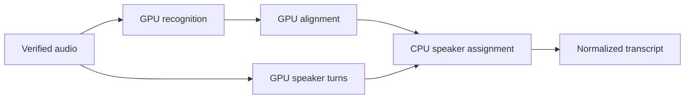

# Temnia pipeline architecture

2026-09-08. This is the implementation design for PR #24, following the merged S2 baseline
in PR #23. The chapter runtime is implemented on PR #24; implementation does not establish
editorial accuracy or deployment qualification. The [status record](design/harness-implementation-status-2026-09-08.md)
and [staging qualification](design/s2-staging-qualification-2026-09-08.md) distinguish those states.
The PRD describes product intent, and the sprint plan describes sequence; neither overrides
a measured improvement. This document supersedes contradictory details in the earlier
[S3 slice specification](plans/s3-harness-spec.md).

## Product path and ownership

The first complete harness produces a partition of a source into chapters and explicit drops.
Every interval has one owner; adjacent sections reference the same cut. Models propose editorial
structure using evidence IDs. Code compiles times, validates the partition, renders media and
checks the files. A person can inspect, accept, reject, nudge, restore, merge and undo decisions.
The same immutable edit map drives preview and export.

Temporal remains the only durable runtime. Next.js resolves organization scope and starts or
queries work. Python owns media, editorial operations and database DML. Drizzle owns schema,
grants, forced RLS and isolation tests. Artifacts live in the organization's object prefix;
Postgres records identities, dependencies, revision pointers and money. Media reads go through
the existing scoped proxy. No route calls a model directly.

The Python process serves heavy activities and workflows on the configured pipeline queue,
with two activity slots, and short chapter database controls on `<pipeline queue>-control`,
with four slots. Both workers start and drain together in the same namespace. This prevents
long media jobs from occupying all capacity needed to admit cancellation or a budget command.
The queue name derives from the workflow's actual queue; there is no second routing setting
to mismatch. Downloads, model calls, rendering and artifact publication stay on the media
queue. Controls remain regular, durable activities with bounded execution and idempotent
transactions. A real-worker probe confirmed control progress while both media slots were held;
its timing is a scheduling observation, not a production latency guarantee. Local activities
were considered, but their marker/replay and no-heartbeat semantics offer no benefit for these
database commands. [Temporal task queues](https://docs.temporal.io/task-queue),
[local activity tradeoffs](https://docs.temporal.io/local-activity).

`ChapterRunWorkflow` is finite: it produces a reviewable revision and completes. Each human
command starts a finite `ChapterReviewWorkflow`, identified by run ID and client mutation UUID.
Its durable event stores the applied, refused or conflicting outcome. Duplicate starts and
activity deliveries return that outcome. Revision compare-and-swap preserves edits made by
another tab while a command was in flight. Accepted revisions remain visible while a replacement
is rendered. This was compared with a days-open review workflow; immutable revisions already
own the review truth, so finite executions avoid tying that truth to one waiting execution's
lifetime. [Temporal distinguishes workflow IDs and individual runs](https://docs.temporal.io/workflow-execution/workflowid-runid).

Human approval closes editorial review. A preserved model verdict may ask for review, but cannot
veto the subsequent reasoned acceptance of every section. Every required technical check must be
present exactly once, and none may fail; warnings remain visible. Acceptance and rejection change
review state and reasons without changing media:
their new revision descriptors reuse checked media and technical evidence with explicit predecessor
dependencies, without another model call or full decode. The reuse path verifies that all source,
interval, title, section-kind and non-review fields are unchanged. Content mutations use the render
and verification path. If final export fails after the last acceptance, retry can finish that same
revision; it does not require the person to invent another edit.

## Evidence and edit contracts

`HarnessEvidence` pins the transcript ID, revision and exact object hash, source fingerprint,
segmenter configuration and model revisions. It contains words, sentences, pauses, candidate
boundaries, independent speech coverage, optional shots and media time bases. Word IDs belong
to that evidence version; structural transcript corrections must preserve explicit lineage,
not pretend array indices remain stable. Downstream artifacts name both artifact ID and hash.

Evidence identity belongs to the source and producer inputs, so multiple runs on the same frozen
source can share it. Each scoped run stores its evidence pointer separately. Evidence metadata does
not carry a consumer run ID; duplicate acceptance disregards only that legacy transient key while
still requiring exact bytes, stable metadata, transcript identity and dependency IDs.

The source fingerprint includes the downloaded master SHA-256, observed object identity and
selected-stream timeline. A matching filename, object size or rounded duration is insufficient.
Preparation verifies those bytes before paid planning, and rendering verifies the same identity
before reusing a local master. A same-size replacement fails instead of inheriting an old edit.
An ETag is retained as store evidence, not interpreted as a universal content checksum.

Evidence construction rejects missing words, duplicate IDs, invalid or overlapping lexical
ownership, ungrounded sentence ranges, nonfinite values and times outside the source. Empty
evidence is representable but does not trigger paid planning. Unavailable speech or visual
evidence stays unknown. Detector agreement is not a claim of transcription accuracy.

The chapter evidence path uses the pinned universal SaT sentence model and records the
transcript's detected language. It does not route every language through the existing English
MiniLM change-point candidate model. The latter remains an explicitly selected evaluation
candidate. This keeps lexical evidence complete without claiming language-specific editorial
quality: SaT's published model is multilingual, while MiniLM's card labels English and a
256-wordpiece default truncation limit. Neither fact substitutes for held-out language tests.
The model prompt preserves source text and language metadata; context sizing is byte-based,
not an English word-count estimate. Oversized context uses whole-sentence hierarchy, and an
indivisible oversized sentence is refused with an explanation rather than silently truncated.
[SaT model card](https://huggingface.co/segment-any-text/sat-3l-sm),
[MiniLM model card](https://huggingface.co/sentence-transformers/all-MiniLM-L6-v2).

The model's proposal is an ordered exact cover of sentence IDs, with grounded quote-word IDs,
keep/drop decisions, titles and reasons. It cannot author milliseconds. No validator silently
fills a gap, discards an overlap or trims an awkward interval into a plausible answer. A bounded
repair may submit a new proposal; the original remains inspectable. Source text is quoted
evidence, never instructions authorizing tools or changing the editing brief.

The compiler chooses shared boundaries jointly from a monotonic candidate graph. Candidate
costs expose displacement from the proposed sentence transition, acoustic clearance, speaker
continuity, optional shot evidence and review flags. An ordered dynamic program chooses the
minimum-cost valid path. No safe candidate means a wider local search or a visible review flag,
not an invented cut. There is no hard quota for chapter count or duration. Uncalibrated weights
are provisional and must not be described as optimized before annotated boundary-window tests.

Time is source-relative rational time. Exact frame rate, video time base, sample rate and signed
source offset come from the media probe; rounded database fps is insufficient for compilation.
Frame/sample quantization uses one canonical source-relative output grid for each shared boundary. The signed container start maps to source media; it is not assumed to be the phase of a decoded video frame lattice. VFR input and track offsets are checked by the renderer, with explicit frame/codec tolerance. The first and last edges
are fixed to the source interval, and keeps plus drops exactly cover it. Rendered duration is
checked against the expected quantized interval with a stated codec/frame tolerance.

## Persistence and source lifetime

Eight scoped tables separate durable concerns:

| Table | Meaning |
| --- | --- |
| `harness_artifact` | Accepted immutable bytes, input fingerprint, SHA, size, scoped storage key |
| `harness_artifact_dependency` | Existing input artifacts consumed by a newly published artifact |
| `harness_run` | Request identity, progress, immutable route/config snapshot, revision pointers, budget counters |
| `harness_operation` | Logical work identity and its accepted result or unresolved outcome |
| `harness_attempt` | One admitted provider invocation, owner fence, handle, observed execution telemetry and expense state |
| `harness_reservation` | Exposure held against a run until released or settled |
| `chapter_revision` | Immutable edit revision and mutation identity |
| `chapter_review_event` | Replayable outcome of a human command |

Composite references include organization and source; an ID from another source is not authority.
The app reads harness tables but cannot mutate them. The pipeline can insert immutable history
and update only mutable operational state. Publication validates scope, writes content-addressed
bytes, then accepts the row in a short transaction. Dependencies already exist before the
consumer. A duplicate fingerprint with different output is a conflict, never an overwrite.
Reads verify size and SHA. A crash can leave unreferenced bytes for later collection, but cannot
make a database row claim nonexistent accepted media. No transaction spans external I/O.

History references restrict source deletion. The existing deletion action must check history
before touching object storage. Under a source row lock it refuses retained harness history or
marks `deletion_requested_at`; new work locks the same source and refuses that flag. Interrupted
deletion retains the flag and can resume. Deleting retained history requires a future explicit
drain, expense settlement and retention operation. A foreign-key failure after deleting files
would be too late. Lock order is source, run, operation, attempt/reservation where those locks
are required. [Postgres row locks](https://www.postgresql.org/docs/current/explicit-locking.html)
provide the exclusion; object storage is not part of the database transaction.

A failed ingest is not automatically an unknown external writer. A bounded history query for the
exact closed run may prove that it rejected the file during `probe_source`, before any media
writer was scheduled. The locked source must also have no persisted probe duration; that marker
commits before every transcode schedule and is never cleared by retry, ruling out an earlier run
having admitted a writer. Eligible histories are the known `claim_source → probe_source →
fail_source` failure or an explicitly false claim followed by `NotClaimable`. The latter lets a
late retry remain harmless after deletion is fenced; retry metadata updates exclude fenced rows.
Writer-bearing, incomplete, unavailable or oversized histories and
other terminal states remain fenced. This preserves deletion of an unreadable upload without
allowing a failed remote submission to be mistaken for confirmed cleanup.

## Paid attempts and recovery

An operation can have several admitted provider attempts. Accepted customer transcription minutes and
provider expense are separate measurements. Known failed attempts still cost money; unknown
usage is not zero. Micro-dollar counters use integers. Before a paid dispatch a transaction
reserves its conservative maximum estimate while locking the run and checking budget and
dispatch limits. Parallel callers cannot each spend the same remaining balance.

| Observed state | Permitted next action |
| --- | --- |
| Reserved, never dispatched | Fence the owner terminal before releasing exposure |
| Dispatch CAS won | Issue exactly one provider request; persist handle as soon as available |
| Accepted result | Reuse its verified artifact; do not call again |
| Known terminal failure | New bounded attempt, with its own reservation and expense |
| Timeout or ambiguous acknowledgment | Keep exposure and stop redispatch until reconciled |
| Cancellation requested | Retain exposure until the remote outcome is confirmed |
| Known result, unknown charge | Continue from result if allowed; keep unresolved cost reserved |
| Actual charge above estimate | Record the real amount, then refuse further over-budget work |

Model SDK retries and model-validation retry loops are disabled. Modal's SDK can retry transport
RPCs with one internal idempotency key; Temnia does not repeat an ambiguously acknowledged spawn.
The workflow decides failover and
repair, and every physical request crosses the same guard. A worker dying after dispatch cannot
turn its lost acknowledgment into an automatic free retry. Known expenses append idempotent
`provider_cost_micros` entries. Reconciliation requires evidence; elapsed seconds times a public
rate is an estimate, not an invoice. The gateway generation lookup supplies reported charge
after asynchronous usage ingestion; missing lookup results remain pending. BYOK totals exclude
external provider charges, so those remain unresolved rather than being inferred from list rates.
See the [generation API contract](https://vercel.com/docs/ai-gateway/sdks-and-apis/rest-api). Gateway budgets cannot replace this ledger because
[their enforcement is a soft cap](https://vercel.com/academy/ai-gateway/set-a-budget).

## Model transport and editorial evaluation

Pin `pydantic-ai-slim[openai,temporal]` 2.40.0, published September 5; the September 8 release
is excluded by the repository's 24-hour age rule. Use `TemporalDurability`, `ResolveModelId`,
`PydanticAIWorkflow` and the plugin, rather than the deprecated wrapper-agent entry point.
The request wrapper performs reservation, dispatch fencing, response publication and settlement
inside the model activity. Serializable dependencies carry identities and a frozen route;
credentials are loaded only by the worker. A September 8 pinned-API probe proved the guard runs inside the actual activity: one synthetic
provider call, zero additional calls during history replay. It also showed that model=None is
refused; a vendor-neutral alias with deferred resolution is required. Ledger crash-window tests
remain a separate acceptance requirement. [Pydantic's Temporal integration](https://pydantic.dev/docs/ai/capabilities/durable_execution/temporal/)
provides the activity boundary; it does not provide Temnia's billing guarantees.

No vendor is selected by a default string. A qualified route snapshot records exact model/family,
input/output/cache/reasoning price semantics, context/output limits, strict-schema and privacy
probe evidence. The current route schema carries no audition-result reference; preserve human
audition reports separately before choosing a production pool. Each seat's pool spans at least three families,
including an open-weight candidate. The verifier excludes every family used to generate or
repair the proposal. Context overflow is a pre-dispatch decision: bounded evidence windows
and hierarchical global planning preserve ID coverage; truncating a transcript is forbidden.
Failover cannot weaken privacy or output contracts. Two independent candidates failing the same
local invariant halt the run with the evidence attached.

The earlier documents say the gateway probe was confirmed, but no saved probe artifact was
found in the repository. On September 8, key-name inspection of both worktrees' env files,
the shell and running staging services found no gateway credential. This is an evidence gap,
not a conclusion about gateway capability. A missing credential blocks live audition while
offline implementation proceeds. Synthetic FunctionModel cassettes are labeled synthetic and
prove wiring only. Production rejects that backend unless explicitly enabled for a dedicated
test environment. Live probe and audition commands have explicit bounded budgets and do not
run from CI.

Quality reports separate exact-cover and media correctness from editorial acceptance. Measure
boundary-window acceptance, correction time, adjustment magnitude, cost per accepted chapter,
per-source latency and recovery behavior. Include failed and unknown attempts and all context
and reasoning usage. Compare full-context and hierarchical planning under matched budgets;
do not select a family from prose or an unrepeatable anecdote. Human labels and held-out results
are not replaced by a model judge's score. The review UI must exist before asking for those labels.

## Speech checkpoints and independent coverage

The existing `temnia-media` protocol 4 remains available while its executions drain. Add
`temnia-speech`, protocol `temnia-speech/1`, with separate `recognize`, `align` and `diarize`
functions and an opt-in provider. Each stage accepts a verified prior checkpoint reference and
publishes a new one before returning a small envelope. Alignment failure therefore reuses
recognition. Final raw output keeps the existing normalizer contract and retains diarization
intervals independently.

Separate functions were compared with checkpoints inside one reused monolith. Single-use
containers initially provide a process-lifetime memory fence for CTranslate2 and Torch, and
stage handles make recovery and telemetry attributable. The tradeoff is extra audio downloads,
model loads and scheduling latency; measure it before enabling reuse.

A September 8 CPU fault probe confirmed a container restart with `retries=0` on a deployed
function. Before model work, each attempt therefore acquires an immutable R2 admission claim;
a replacement container can reuse its completed checkpoint or report an unknown prior outcome.
It cannot repeat inference. The probe exercised the real R2 guard, removed its object and stopped
the temporary app. It did not test failures before function entry or GPU billing.
See the [probe record](design/harness-foundation-probes-2026-09-08.json) and
[Modal's crash behavior](https://modal.com/docs/guide/retries).

The configured L4, four physical CPU cores and 16 GiB have a dated base rate of $1.115712/hour.
The reservation uses $1.25/hour, explicit resource limits and a startup allowance. These are
estimates of admitted work, not invoice guarantees: provider restarts and startup failures may
create unobserved costs. Keep that exposure unknown until billing evidence arrives.
[Resource billing](https://modal.com/docs/guide/resources), [listed rates](https://modal.com/pricing).

Recognition can reduce batch 16 to 8 to 4, at most three admitted attempts, only after an explicit
resource-OOM result. An uncertain remote call never advances that ladder. Keep model and compute
type fixed. Callback percentages are measured when present and null otherwise. Resource sampling
runs alongside native inference and records RSS, whole-device and per-process GPU peaks, Torch
peaks, phase durations, call/container IDs and missing metrics. A partial observation does not
claim a completed peak or known cost.

Independent CPU speech evidence uses ONNX Runtime 1.29.0 and the Silero v6.2.1 16 kHz opset-15
asset at commit `7e30209a3e901f9842f81b225f3e93d8199902b1`, SHA-256
`7ed98ddbad84ccac4cd0aeb3099049280713df825c610a8ed34543318f1b2c49` (1,289,603 bytes).
The explicit setup step verifies the artifact; inference runs offline. Direct ONNX was compared
with the Python package, whose unnecessary Torch/audio dependency constraints conflict with
the existing worker line. Preserve the upstream MIT attribution and verify state/window behavior
against [Silero's tagged implementation](https://github.com/snakers4/silero-vad/tree/v6.2.1).

Compare unions of detected-speech intervals with recognition spans. Internal omissions and tails
produce review evidence, while silence, music, breaths and noise prevent treating VAD as a
transcript oracle. Detector failure preserves a usable transcript with coverage unknown and
a visible reason. Re-qualify the known 151-minute source and deliberately exercise stage failure,
OOM, cancellation and repeated calls. The earlier successful 635.22-second GPU run establishes
long-run plumbing, not the accuracy, recovery or complete expense of this new path.

The independent detector was subsequently run on that same accepted audio, read-only, in
23.618 seconds on the local CPU. It processed 283,140 windows and found 3,534 speech intervals.
Compared with the old provider's raw segment spans, 653.759 seconds of detected speech were
unmatched (8.87%); the largest individual interval was 2.119 seconds. Only 0.434 seconds followed
the final recognized word. The provisional aggregate threshold flags this source for review;
these are detector disagreements, not established omissions. No threshold was tuned to make
the recording pass. The [probe record](design/harness-foundation-probes-2026-09-08.json) pins the
audio, raw response, transcript and detector hashes. The new GPU checkpoint path has its own
[live qualification record](design/checkpointed-speech-qualification-2026-09-09.md), including the
initial known failure, corrected recovery proof, all attempts and unavailable billing evidence.

### Versioned execution and performance qualification

Protocol `temnia-speech/2` retains the separate, single-use GPU processes while exposing the
independence already present in WhisperX: speaker-turn detection needs audio; assigning those
turns to aligned words is a separate CPU operation. In parallel mode the graph is:

The CPU join persists both dependency IDs and hashes. It implements greatest summed overlap
with deterministic nearest-turn fallback and is checked against the tagged upstream assignment
behavior. Reusing the recognition or speaker branch does not rerun it. Concurrent first-stage
admission locks the source, run and operations in a stable order and books their combined
exposure atomically. Any failure drains the sibling; repeated cancellation cannot detach an
owned remote finalizer. Unknown outcomes retain their physical-attempt reservation. Production
can use the existing bounded known-OOM ladder; the fixed benchmark explicitly disables it.
The logical stages use the existing ledger kinds. The CPU join adds the `speech_assignment`
artifact kind through an additive Drizzle enum migration; Drizzle remains the sole DDL owner.

Progress callbacks hand a latest value to a dedicated publisher with one pending value and one
RPC. Five-second coalescing, a two-second RPC timeout and a five-second shutdown bound keep
network stalls out of native inference. Diagnostics record dropped/regressing values, publication
failures and blocking time. Committed stage results establish completion; percentages do not.
The v1 app also receives this transport fix while retaining its protocol and checkpoint schemas.

Every v2 request freezes its CPU/GPU/memory/deadline profile, topology, source build and complete
model-cache identity. The model volume is read-only, links are materialized before freezing, and
runtime verifies exact files. Image identity separately covers WhisperX's bundled VAD, the baked
Punkt tokenizer and library versions. Offline HF settings and a Torch checkpoint precheck prevent
a missing file from silently fetching different weights. Compare the actual deployed identities
before admitting work. Existing v1 runs serialize their original configuration shape and replay
through their original activity selection.

The [controlled experiment plan](plans/speech-optimization-360-view.md) compares synchronous and
coalesced progress, hard-capped four and eight CPUs, and serial versus parallel scheduling on the
same L4/16-GiB profile and frozen assets. Two reversed long-source blocks follow four short
recovery preflights. A durable one-time experiment journal and database lease prevent overlapping
launches from resetting the 36-call admission limit or reusing its exposure budget. Record phase
time, workflow time, CPU utilization/throttling, GPU utilization, output differences and unresolved
costs. A faster wall clock alone does not establish lower cost or greater transcript accuracy.
An investigated CPU persistence failure may use an explicit, locked continuation: retain the failed
run and its charges, recover accepted GPU checkpoints into a separate run with a budget too small
to admit inference, and prove zero additional GPU attempts before proceeding. The journal keeps
its original reservations. GPU and corrected worker builds are recorded separately; all long
comparisons use one worker build.
Same-container model cleanup and snapshots remain deferred until these measurements justify
another comparison. See the [v2 rollout procedure](runbooks/chapter-harness.md#opt-into-the-versioned-parallel-speech-path).

## Rendering, review and qualification

The verified source cache belongs to a run and uses a stable advisory-lock file outside its
disposable workspace. Evidence and render activities hold that lease through their whole use
of the source. Cleanup must acquire it nonblockingly; expiry cannot delete an active reader.
Terminal cleanup and expiry timers cover an idle worker; worker startup restores the remaining
expiry time for retained caches. Disk-pressure eviction reclaims
unlocked caches before a large download. Mtime-only and in-process-only guards were rejected
because neither coordinates separate worker processes. This targets local Unix volumes; remote
mount semantics require their own qualification. The underlying behavior is specified by
[Python's fcntl API](https://docs.python.org/3.13/library/fcntl.html) and
[Linux flock](https://man7.org/linux/man-pages/man2/flock.2.html).

Render the source aspect ratio to MP4 and sidecar captions first. Download a source once per
bounded render batch, reuse unchanged sections by content/config fingerprint, heartbeat within
subprocess work and clean partial local files on cancellation. Verify decodability, expected
duration, streams, audio/video correspondence and caption bounds against the accepted edit hash.
A text-only editorial verdict does not claim inspection of pixels or sound. Export includes a
versioned manifest that names exact edit and media hashes.

The media identity excludes titles and review state: a shared-boundary nudge changes its two
neighbors, while an acceptance or title change reuses the same encoded bytes. Caption identity
also includes lexical evidence and speaker labels. Every descriptor and check still names the
current edit hash, including references to reused media. The decoder checks every selected
packet with strict error handling; stream offsets and endpoints are compared to the original
track clocks with the larger of two video frames or two AAC frames as the tolerance. A required
timestamp that cannot be measured fails qualification. These checks establish construction and
decodability; they do not measure semantic quality, black/frozen frames or content-based lip sync.

The renderer normalizes VFR video to its declared constant frame grid, preserves display
orientation and sample aspect, and pads odd dimensions by at most one pixel for H264/yuv420p.
Audio-only and video-only files take explicit paths. Captions are derived from intersecting
evidence words; a cut-crossing word is clipped and flagged. Manual transcript timings remain
manual evidence and never become aligner confidence through rendering.

Scratch preflight estimates source bytes plus twice the source-proportional output size and a
1 GiB margin. This is a capacity estimate, not a worst-case encoding bound: CRF encoding can
expand highly compressed inputs, and other work can consume disk concurrently. Runtime disk
checks must stop and reap owned encoders before consuming the remaining floor. Subprocess
cancellation terminates the owned process group, escalates after five seconds and awaits pipe
readers; partial outputs are removed. A failed local render does not authorize another model call.

The current renderer retains ffmpeg 8.1.2 after comparison with the official 9.0.1 release: accurate seeking, rational timestamp transforms, H264/AAC and the required filters are already available on the existing matched CLI/PyAV line. This is not a claim that 9.0.1 is incompatible. A bump requires chapter and existing ladder/NVENC regression evidence. [Current release branches](https://ffmpeg.org/download.html).

A September 8 [probe record](design/harness-foundation-probes-2026-09-08.json) verifies R2 conditional creation with the running staging store: the second differing write was refused, original bytes preserved and the temporary object removed. Actual pinned ONNX inference on a 40-second synthesized-speech fixture took 1.073 seconds, processing 1,254 windows into 14 intervals. These checks establish API/execution behavior, not human speech accuracy or GPU checkpoint recovery.

The review surface shows starting, running, budget-paused, uncertain, failed, ready and conflicting
states with a concrete next action. Manual nudges update a shared boundary and invalidate both
neighbors. Restore/merge/undo create revisions; they do not overwrite history. A repeated command
returns its prior outcome. Acceptance refers to a specific revision and checked media, so a stale
tab cannot accept replacement outputs accidentally.

Qualification includes real scoped Postgres race tests, provider-call counters across durable
replay, corruption and publication-crash tests, compiler exact-cover cases, rendered-file checks,
and production-image Playwright exercising each review operation. The repository's exact-SHA
gate remains the delivery mechanism. Existing staging is main; PR #24 stays a reviewed branch
until Rajesh chooses to merge. Staging test evidence and known limits are written with actual
numbers, including unknown costs and missing human judgments.
